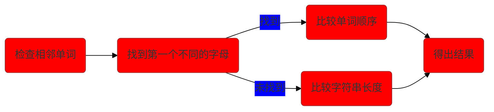

##  LeetCode具有美感的代码


### 经常使用的API

#### **1.Deque**

**常用实现类**

* **`ArrayDeque`**，
* **`LinkedList`**

| 返回值 |                 方法                 |                             说明                             |
| :----: | :-----------------------------------: | :----------------------------------------------------------: |
|  | ==添加== |  |
|   E    | addFirst(E e)  | 如果可以在不违反容量限制的情况下立即插入指定元素，则在此双端队列的前面插入指定元素，如果当前没有可用空间，则抛出 `IllegalStateException` |
|   E    |             addLast(E e)              | 如果可以在不违反容量限制的情况下立即插入指定元素，则在此双端队列的**末尾**插入指定元素，如果当前没有可用空间，则抛出 `IllegalStateException` |
|  | ==添加（推荐）== |  |
| boolean | offer(E e) | 将指定的元素插入此双端队列表示的队列中（换句话说，在此双端队列的**尾部**），如果它是立即可行且不会违反容量限制，返回 `true`在成功和 `false`如果当前没有空间可用。 |
| boolean | offerFirst(E e) | 将指定元素插入此双端队列的前面，除非它违反容量限制。 |
| boolean | offerLast(E e) | 在此双端队列的末尾插入指定的元素，除非它违反容量限制。 |
|  | ==检索== |  |
| E | peek() | 检索但不移除此双端队列表示的队列的头部（换句话说，此双端队列的第一个元素），如果此双端队列为空，则返回 `null` 。 |
| E | peekFirst() | 检索但不删除此双端队列的第一个元素，如果此双端队列为空，则返回 `null` |
| E | peekLast() | 检索但不删除此双端队列的最后一个元素，如果此双端队列为空，则返回 `null` |
|  | ==删除== |  |
| E | poll() | 检索并删除此双端队列表示的队列的头部（换句话说，此双端队列的第一个元素），如果此双端队列为空，则返回 `null` 。 |
| E | pollFirst() | 检索并删除此双端队列的第一个元素，如果此双端队列为空，则返回 `null` |
| E | pollLast() | 检索并删除此双端队列的最后一个元素，如果此双端队列为空，则返回 `null` |

#### 2.Queue

**常用实现类**

* **ArrayDeque**
* **`LinkedList`**
* **`PriorityQueue`**
* **ArrayBlockingQueue**
* ...

```java
Queue<String> queue = new LinkedList<String>();
```

| 返回值  |    方法     |                             描述                             |
| :-----: | :---------: | :----------------------------------------------------------: |
|         |  ==推荐==   |                                                              |
| boolean | offer(E  e) | 如果可以在不违反容量限制的情况下立即执行此操作，则将指定的元素插入此队列。 |
|    E    |   peek()    |  检索但不删除此队列的头部，如果此队列为空，则返回 `null` 。  |
|    E    |   poll()    |   检索并删除此队列的头部，如果此队列为空，则返回 `null` 。   |
|         | ==不推荐==  |                                                              |
|  void   |  add(E e)   | 如果可以在不违反容量限制的情况下立即执行此操作，则将指定的元素插入此队列，成功时返回 `true` ，如果当前没有空间，则抛出 `IllegalStateException` 。 |
|    E    |  element()  |                   检索但不删除此队列的头部                   |
|    E    |  remove()   |                    检索并删除此队列的头部                    |

##### PriorityQueue(堆)

[例子](#yxjdl0107)

[例子](#yxjdl01072)

:ice_cream:只要题目中出现前`k`个`最大`或`最小`就需要==考虑优先级队列(堆)==

> 默认创建一个初始容量为==11==的优先级队列
>
> 后面的参数中可以传递一个比较器
>
> `Comparator<? super E> comparator` eg:`(a, b)-> b-a`
>
> * `a - b`代表从小到大排列,<font  color='red'>可以省略</font>
> * `b - a`代表从大到小排列,<font  color='red'>必须带上</font>

```java
PriorityQueue<Integer> q= new PriorityQueue<Integer>((a, b)-> b-a );
//----------------------------------------------------------------------
Queue<List<Integer>> q = new PriorityQueue<>((a,b) -> {
    return a.get(0)+a.get(1) - b.get(0)-b.get(1);
});
```


#### 3.Map


**map初始化：**

```java
Map<String, String> map = new HashMap<String, String>();
```

**类型区别**

* HashMap

  > 最常用的Map,它根据键的HashCode 值存储数据,根据键可以直接获取它的值，==具有很快的访问速度==。HashMap最多==只允许一条记录的键为Null==(多条会覆盖);允许多条记录的值为 Null。==非同步的==。

* TreeMap

  > 能够把它保存的记录==根据键(key)排序,默认是按升序排序==，也可以指定排序的比较器，当用Iterator 遍历TreeMap时，得到的记录是排过序的。==TreeMap不允许key的值为null==(因为可以排序所以不允许key为空)。==非同步的==。

* Hashtable

  > **与 HashMap类似**,不同的是:==key和value的值均不允许为null;它支持线程的同步==（线程排队，没得到结果前调用不返回！），即任一时刻只有一个线程能写Hashtable,因此也导致了Hashtale在==写入时会比较慢==。

* LinkedHashMap

  > 保存了==记录的插入顺序==，在用Iterator遍历LinkedHashMap时，先得到的记录肯定是先插入的.在遍历的时候会比HashMap慢。==key和value均允许为空==，==非同步的==。


|   返回值   |                   方法                    |                             描述                             |
| :--------: | :---------------------------------------: | :----------------------------------------------------------: |
|   Object   |          put(Object k, Object v)          |                          存入键值对                          |
|   Object   |               get(Object k)               |        返回键所映射的值；如果不存在该映射则返回 null         |
|     V      | getOrDefault(Object key , V defaultValue) | 返回指定键映射到的值，如果此映射不包含该键的映射，则返回defaultValue。 |
|  boolean   |           containsKey(Object k)           |                         是否包含键 k                         |
|  boolean   |          containsValue(Object v)          |                         是否包含值 v                         |
|  boolean   |                 isEmpty()                 |                         Map 是否为空                         |
|    int     |                  size()                   |                     返回 Map 的键值对数                      |
|    Key     |                firstKey()                 |                检索具有最低键值的第一个建元素                |
|  boolean   |             remove(Object k)              | 如果存在一个键映射关系，则删除此关系 (映射关系不存在不会报错) |
|    void    |                  clear()                  |                   移除 Map 中所有映射关系                    |
|  boolean   |            equals(Object obj)             |                比较指定对象于此 Map 是否相等                 |
|    void    |               putAll(Map m)               |             将指定 Map 的映射关系复制到此 Map 中             |
| Collection |                 values()                  |             以 Collection 形式返回 Map 包含的值              |
|    Set     |                 keySet()                  |                 以 Set 形式返回 Map 包含的键                 |
|    Set     |                entrySet()                 |                以 Set 形式返回 Map 的映射关系                |

**经常使用遍历方法：**

1.  只获取键or值

   ```java
   // 获取键
   for(Integer key: map.keyset()){
       System.out.println(key);
   }
   
   // 获取值
   for(Integer value: map.values()){
       System.out.println(value);
   }
   ```

   

2. 同时获取键值

   ```java
   // 2.1 先取key再取value。不推荐
   
   for(Integer key:map.keySet()){
       System.out.println(map.get(key));
   }
   
   // 2.2 通过map entrySet遍历。性能优于上一种。
   
   for(Map.Entry<Integer, Integer> entry: map.entrySet()){
       System.out.println(entry.getKey() + ":" + entry.getValue());
   }
   
   ```

   

3. Iterator

   上面的 foreach 都可以用 Interator 代替。

   ==foreach 是对 Set 遍历，大小不能改变。如果改变 map 的大小，会报错。如果想要删除元素，还是要用 Interator 的方式删除。==

   ```java
   Interator<Map.Entry<Integer, Integer>> it = map.entrySet().iterator();
   while(it.hasNext()){
       Map.Entry<Integer, Integer> entry = it.next();
       System.out.println(entry.getKey() + ":" + entry.getValue());
       // it.remove()  删除元素
   }
   ```

   

4.  Lambda

   代码简洁，性能差于entrySet

   ```java
   map.forEach((key, value)->{
       System.out.println(key + ":" + value);
   });
   ```


**computeIfAbsent**

```java
/*
 只有在当前 Map 中 key 对应的值不存在或为 null 时
 才调用 mappingFunction
 并在 mappingFunction 执行结果非 null 时
 将结果跟 key 关联．
 mappingFunction 为空时 将抛出空指针异常
*/

// 函数原型 支持在 JDK 8 以上
public V computeIfAbsent(K key, Function<? super K, ? extends V> mappingFunction)

```

示例

```java
Map<String, List<String>> map = new HashMap<>();
List<String> list;

// 一般这样写
list = map.get("list-1");
if (list == null) {
    list = new LinkedList<>();
    map.put("list-1", list);
}
list.add("one");

// 使用 computeIfAbsent 可以这样写
list = map.computeIfAbsent("list-1", k -> new ArrayList<>());
list.add("one");

//简化
list = map.computeIfAbsent("list-1", k -> new ArrayList<>()).add("one");
```

我的理解是类似于`getOrDefault`但是map中的键是一个==复杂类型==


#### 4.二分模板

```java
while(l < r){
    int mid = l + r +1 >> 1;
    if(check(mid) <= target){ // 这里也可以是>= 但是一定要有=
        l = mid;
    }else{
        r = mid -1;
    }
} // 退出循环后还需要判断的话使用r来判断，以为此时（l 和 r相等）是最后可能的值

//==============================================================================
int l = 0,r = n-1;
while( l < r){
    int mid = l+(r-l>>1);
    if(matrix[i][mid] == target)return true;
    else if(matrix[i][mid] < target) l = mid+1;
    else r = mid;
}
if(matrix[i][l] == target)return true;	//防止只有一个数据的情况


//==========================多尝试这个=============================================
while( l<=r){
    int mid = l + (r-l>>1);
    if(matrix[i][mid] == target)return true;
    else if(matrix[i][mid] < target)l = mid+1;
    else r = mid-1;
}
```

:ice_cream:第三种方式的二分查找法的结束条件是`| r | l |`所以如果没有找到目标的数据,则`r`代表的是<font  color='cblue'>第一个小于目标值</font>`x`的值,`l`代表的是<font  color='orange'>第一个大于</font>`x`的值


#### 5.单调栈

[例子-中等](#ddz1230)

[例子-困难](#ddz12)

对序列中每个元素，找到下一个比它大的元素。（当然，“下一个”可以换成“上一个”，“比它大”也可以换成“比他小”，原理不变。）

**分类：**

* 单调递增栈：单调递增栈就是从**栈顶**->**栈底**-==从小到大==
* 单调递减栈：单调递减栈就是从**栈顶**->**栈底**-==从大到小==

```java
// 单调栈伪代码
stack<int> st;
//此处一般需要给数组最后添加结束标志符，具体下面例题会有详细讲解
for (遍历这个数组)
{
	if (栈空 || 栈顶元素大于等于当前比较元素)
	{
		入栈;
	}
	else
	{
		while (栈不为空 && 栈顶元素小于当前元素)
		{
			栈顶元素出栈;
			更新结果;
		}
		当前数据入栈;
	}
}

```


#### 6.栈


```java
Deque<Integer> stack = new LinkedList<>();
```

```java
// 推荐使用ArrayDeque方式
Deque<Integer> stack = new ArrayDeque<>();
stack.pop();	//弹出元素
stack.isEmpty();//判断栈是否为空
stack.push(1);	//添加元素
stack.peek();	//查询栈顶元素 此API必须配合push的API使用,因为push是在队列头部添加元素,peek出来的就是栈顶元素
```

**该用ArrayDeque还是LinkedList？**
ArrayDeque和LinkedList这两者底层，一个采用数组存储，一个采用链表存储；

* 数组存储，容量不够时需要扩容和数组拷贝，通常容量不会填满，会有空间浪费；

* 链表存储，每次push都需要new Node节点，并且node节点里面有prev和next成员，也会有额外的空间占用。

那么问题来了，在用作栈时到底用ArrayDeque好还是LinkedList好呢？

结论：**ArrayDeque会略胜一筹，不过差别通常可以忽略**


#### 7.DFS、BFS模板

**DFS**

```java
public static void dfs(){
	if(xxx)return;			// 1.写出退出条件
    yyyyyy;					// 2.写出dfs最终要干的事情->业务逻辑
    dfs(zzz);				// 3.写出继续遍历
}
```

```java
// 二叉树深度优先遍历
public static void dfsBinary(TreeNode root){
    if(root == null || visitedBinary.contains(root.val)){
        return;
    }
    visitedBinary.add(root.val);
    dfsBinary(root.left);
    dfsBinary(root.right);
}
```

**BFS**

```java
// 二叉树的广度遍历
public static List<Integer> bfsBinary(TreeNode root){
    List<Integer> resultList = new ArrayList<>();
    LinkedList<TreeNode> queue = new LinkedList<>();
    queue.add(root);
    while (!queue.isEmpty()){
        TreeNode node = queue.poll();
        resultList.add(node.val);
        if(node.left != null){
            queue.add(node.left);
        }
        if(node.right != null){
            queue.add(node.right);
        }
    }
    return resultList;
}
// N叉树广度优先遍历
public static List<Integer> bfsChildren(TreeNode2 root){
    List<Integer> resultList = new ArrayList<>();
    LinkedList<TreeNode2> queue = new LinkedList<>();
    queue.add(root);
    while (!queue.isEmpty()){

        TreeNode2 node = queue.poll();
        resultList.add(node.val);

        if(node.children != null && node.children.size()>0){
            for(int i=0;i<node.children.size();i++){
                queue.add(node.children.get(i));
            }
        }

    }
    return resultList;
}
```


#### 8.Set

##### API

|                            返回值                            |                             方法                             |                             描述                             |
| :----------------------------------------------------------: | :----------------------------------------------------------: | :----------------------------------------------------------: |
|                           boolean                            | **[add](https://docs.oracle.com/javase/7/docs/api/java/util/Set.html#add(E))**([E](https://docs.oracle.com/javase/7/docs/api/java/util/Set.html) e) |           如果指定的元素不存在，则将其添加到此集合           |
|                           boolean                            | **[ addAll](https://docs.oracle.com/javase/7/docs/api/java/util/Set.html#addAll(java.util.Collection))**(Collection<? extends E> c) |   如果指定集合中的所有元素尚未存在，则将它们添加到此集合。   |
|                             void                             | **[clear](https://docs.oracle.com/javase/7/docs/api/java/util/Set.html#clear())**() |                    从此集合中删除所有元素                    |
|                           boolean                            | **[contains](https://docs.oracle.com/javase/7/docs/api/java/util/Set.html#contains(java.lang.Object))**([Object](https://docs.oracle.com/javase/7/docs/api/java/lang/Object.html) o) |            如果此集合包含指定的元素，则返回true。            |
|                           boolean                            | **[ containsAll](https://docs.oracle.com/javase/7/docs/api/java/util/Set.html#containsAll(java.util.Collection))**(Collection<?> c) |         如果此集合包含指定集合的所有元素，则返回true         |
|                           boolean                            | **[equals](https://docs.oracle.com/javase/7/docs/api/java/util/Set.html#equals(java.lang.Object))**([Object](https://docs.oracle.com/javase/7/docs/api/java/lang/Object.html) o) |              将指定对象与此集合进行相等性比较。              |
|                           boolean                            | **[isEmpty](https://docs.oracle.com/javase/7/docs/api/java/util/Set.html#isEmpty())**() |            如果此集合不包含任何元素，则返回true。            |
|                         Iterator<E>                          | **[iterator](https://docs.oracle.com/javase/7/docs/api/java/util/Set.html#iterator())**() |                  返回此集合中元素的迭代器。                  |
|                           boolean                            | **[remove](https://docs.oracle.com/javase/7/docs/api/java/util/Set.html#remove(java.lang.Object))**([Object](https://docs.oracle.com/javase/7/docs/api/java/lang/Object.html) o) |                   从该集合中删除指定的元素                   |
|                             int                              | **[size](https://docs.oracle.com/javase/7/docs/api/java/util/Set.html#size())**() |                     返回此集合中的元素数                     |
| [Object](https://docs.oracle.com/javase/7/docs/api/java/lang/Object.html)[] | **[toArray](https://docs.oracle.com/javase/7/docs/api/java/util/Set.html#toArray())**() |               返回包含此集合中所有元素的数组。               |
|                           <T> T[]                            | **[toArray](https://docs.oracle.com/javase/7/docs/api/java/util/Set.html#toArray(T[]))**(T[] a) | 返回包含此集合中所有元素的数组；返回数组的运行时类型是指定数组的运行时类型。 |


**实现set接口的类**


---

##### hashSet

> **Set<> hashSet = new HashSet<>();**

hashCode()效率是比equals()效率高的。
所以HashSet判断元素是否相等时==先用hashCode()判断==，如果hashCode()不同，则对象不等，如果hashCode()相同，==再比较equals()== ，大大提高了效率。

```java
//HashSet的底层是hashmap
//HashMap实例具有默认初始容量 (16) 和负载因子 (0.75)。
public HashSet() {
    map = new HashMap<>();
}
```


* HashSet:==不能保证元素的顺序==；==不可重复==；==线程不安全==的；==元素可以为 NULL==;

* 其底层其实是一个hashmap，存在的意义是加快查询速度。

* 对于 HashSet: 如果两个对象通过 equals() 方法返回 true，这两个对象的 hashCode 值也应该相同。

  * 如果 hashCode 值不同，直接把该元素存储到 hashCode() 指定的位置

  * 如果 hashCode 值相同，那么会继续判断该元素和集合对象的 equals() 作比较

    * hashCode 相同，equals 为 true，则视为同一个对象，不保存在 hashSet（）中
    * hashCode 相同，equals 为 false，则存储在之前对象同槽位的链表上


**总结:**

- 说白了，HashSet就是==限制了功能的HashMap==，所以了解HashMap的实现原理，这个HashSet自然就通
- 对于HashSet中保存的对象，主要要正确重写equals方法和hashCode方法，以保证放入Set对象的唯一性
- ==虽说是Set是对于重复的元素不放入，**倒不如直接说是底层的Map直接把原值替代了**==（这个Set的put方法的返回值真有意思）
- HashSet没有提供get()方法，原因是同HashMap一样，Set内部是无序的，只能通过迭代的方式获得


**注意：**

* 每一个存储到 哈希 表中的对象，都得提供 ==hashCode()== 和 ==equals()== 方法的实现，用来判断是否是同一个对象
* 对于 HashSet 集合，==equals（）返回true，则hashcode必相等==

---


##### linkedHashSet

> **Set linkedHashSet = new LinkedHashSet();**

LinkedHashSet是继承自HashSet(启用HashSet中预留的构造方法)，底层实现是==LinkedHashMap但LinkedHashMap继承了HashMap所以底层还是HashMap只不过附加了一条accessOrder=false==。

如果accessOrder = true 则代表按照访问顺序排序(afterNodeAccess方法就会启用),false代表按照插入顺序

* ==不可重复==，==有序==


LinkedHashMap 在HashMap结构的基础上，增加了一条双向链表，使得结构可以保持键值对的插入顺序。同时通过对链表进行相应的操作，实现了访问顺序相关逻辑。其结构可能如下图


 **Entry 的继承体系**


上面的继承体系乍一看还是有点复杂的，同时也有点让人迷惑。HashMap 的内部类 TreeNode 不继承它的了一个内部类 Node，却继承自 Node 的子类 LinkedHashMap 内部类 Entry。这里这样做是有一定原因的，这里先不说。先来简单说明一下上面的继承体系。LinkedHashMap 内部类 Entry 继承自 HashMap 内部类 Node，并新增了两个引用，分别是 before 和 after。这两个引用的用途不难理解，也就是用于维护双向链表。同时，TreeNode 继承 LinkedHashMap 的内部类 Entry 后，就具备了和其他 Entry 一起组成链表的能力。但是这里需要大家考虑一个问题。当我们使用 HashMap 时，TreeNode 并不需要具备组成链表能力。如果继承 LinkedHashMap 内部类 Entry ，TreeNode 就多了两个用不到的引用，这样做不是会浪费空间吗？简单说明一下这个问题（水平有限，不保证完全正确），这里这么做确实会浪费空间，但与 TreeNode 通过继承获取的组成链表的能力相比，这点浪费是值得的。


**LinkedHashMap 如何建立链表?**


LinkedHashMap 覆写了红色方法,(红色方法中包含了linkNodeLast方法)。在这个方法中，LinkedHashMap 创建了 Entry，并通过 linkNodeLast 方法将 Entry 接在双向链表的尾部，实现了双向链表的建立。双向链表建立之后，我们就可以按照插入顺序去遍历 LinkedHashMap

```java
// Callbacks to allow LinkedHashMap post-actions
// 在hashmap中的putVal()中包含1,2是通过回调的方式通知linkedhashmap做一些后置操作

// afterNodeAccess 在插入或获取元素的时候回调用,当且仅当accessOrder=true时,即按访问顺序排序时会执		行该方法
void afterNodeAccess(Node<K,V> p) { }
//用来回调移除最早放入Map的对象
void afterNodeInsertion(boolean evict) { }
// 删除的后置操作
void afterNodeRemoval(Node<K,V> p) { }
```


 **链表节点的删除过程**

1. 根据 hash 定位到桶位置
2. 遍历链表或调用红黑树相关的删除方法
3. 从 LinkedHashMap 维护的双链表中移除要删除的节点


---


##### TreeSet

> **Set treeSet = new TreeSet();**

TreeSet:==有序==；==不可重复==，底层使用 ==红黑树==算法，==元素不可以为NUll==，擅长于==范围查询==。

如果使用 TreeSet() 无参数的构造器创建一个 TreeSet 对象, 则要求放入其中的元素的类==必须实现 Comparable== 接口所以, 在其中不能放入 null 元素

* **必须放入同样类的对象**.(默认会进行排序) 否则可能会发生类型转换异常.我们可以使用泛型来进行限制
* **自动排序**：添加自定义对象的时候，必须要实现 Comparable 接口，并要覆盖 compareTo(Object obj) 方法来自定义比较规则

```java
// 底层是Treemap
public TreeSet() {
    this(new TreeMap<E,Object>());
}
```

```java
// TreeSet的比较器存在可能会导致元素的重复
// 存放元素时，TreeMap实现外部比较器接口Comparator，并重写其compare方法，
// 当判断元素重复时，强制compare方法返回一个非0的数，就可以将重复元素存入；

// 以下写法可以避免TreeSet中的元素重复
TreeSet<Integer> set = new TreeSet<>((o1,o2)-> o2 - o1);	// 推荐(从大到小排序,默认是从小到大!)
TreeSet<Integer> set = new TreeSet<>((o1,o2)-> o1 == o2 ? 0 : o2 - o1);
```

| 返回值 | 方法         | 描述                                                         |
| :----- | ------------ | :----------------------------------------------------------- |
| E      | ceiling(E e) | 返回此set中大于或等于给定元素的 `null`元素，如果没有这样的元素，则 `null` 。 |
| E      | floor(E e)   | 返回此set中小于或等于给定元素的最大元素，如果没有这样的元素，则 `null` 。 |
| E      | first()      | 返回此集合中当前的第一个（最低）元素。                       |
| E      | last()       | 返回此集合中当前的最后一个（最高）元素。                     |
| E      | lower(E e)   | 返回此集合中的最大元素严格小于给定元素，如果没有这样的元素，则 `null` 。 |


---

##### 总结

共同点：

* 都不允许元素重复
* 都不是线程安全的类，解决办法：==Set set = Collections.synchronizedSet(set 对象)==

不同点：

* HashSet:==不保证元素的添加顺序==，底层采用 ==哈希表算法==，==查询效率高==。判断两个元素是否相等，equals() 方法返回 true,hashCode() 值相等。即要求存入 HashSet 中的元素要覆盖 equals() 方法和 hashCode()方法
* LinkedHashSet:HashSet 的子类，==保证元素的添加顺序==，底层采用了 ==哈希表算法以及链表算法==，既保证了元素的添加顺序，也保证了查询效率。但是整体性能要低于 HashSet　　　　
* TreeSet:==不保证元素的添加顺序==，但是会对集合中的==元素进行排序==。底层采用 ==红-黑 树算法==（树结构比较适合范围查询）

---

##### Set集合遍历

* 迭代遍历：

  ```java
  Set set = new HashSet();
  Iterator it = set.iterator();
  while (it.hasNext()) {
      String str = it.next();
      System.out.println(str);
  }
  ```

* for循环:

  ```java
  for (String str : set) {
  	System.out.println(str);
  }
  ```


#### 9.ArrayList

[简例](#sxb0112)

 boolean ==add==(E e):将指定的元素添加到此列表的尾部。

 void ==add==(int index,E element):将指定的元素插入此列表中的指定位置。

 void ==clear==(): 移除此列表中的所有元素。

 boolean ==contains==(Object o):判断此列表是否包含指定的元素，如果包含返回true，否则返回false。

 E ==get==(int index):返回指定位置的元素。

 int ==indexOf==(Object o):返回此列表中首次出现的指定元素的索引，或如果此列表不包含元素，则返回 -1。

 boolean ==isEmpty==():如果此列表中没有元素，则返回 true

 E ==remove==(int index):移除此列表中指定位置上的元素，并把移除的元素返回

boolean ==removeAll==(Collection<?> c):从此列表中删除指定集合中包含的所有元素。

 E ==set==(int index,E e):用指定的元素替代此列表中指定位置上的元素。

 int ==size==():返回此列表中的元素个数。

Iterator<E> ==iterator==() :按正确的顺序返回此列表中元素的迭代器。

void ==sort==(Comparator<? super E> c):根据指定比较器产生的顺序对此列表进行排序。

T[] ==toArray==(T[] a):返回一个数组，该数组按正确顺序（从第一个元素到最后一个元素）包含此列表中的所有元素；返回数组的运行时类型是指定数组的运行时类型。


#### 10. Character

|                      方法                      |                             描述                             |
| :--------------------------------------------: | :----------------------------------------------------------: |
|           void Character(char value)           |   构造一个新分配的 Character 对象，用以表示指定的 char 值    |
|                char charValue()                |      返回此 Character 对象的值，此对象表示基本 char 值       |
| int ==compareTo==(Character anotherCharacter)  |               根据数字比较两个 Character 对象                |
| boolean ==equals==(Character anotherCharacter) | 将此对象与指定对象比较，当且仅当参数不是 null，而 是一个与此对象 包含相同 char 值的 Character 对象时， 结果才是 true |
|          boolean ==isDigit==(char ch)          | 确定指定字符是否为数字，如果通过 Character. getType(ch) 提供的字 符的常规类别类型为 DECIMAL_DIGIT_NUMBER，则字符为数字 |
|      boolean ==isLetter==(int codePoint)       |           确定指定字符（Unicode 代码点）是否为字母           |
|   boolean ==isLetterOrDigit==(int codePoint)   |        确定指定字符（Unicode 代码点）是否为字母或数字        |
|        boolean ==isLowerCase==(char ch)        |                  确定指定字符是否为小写字母                  |
|        boolean ==isUpperCase==(char ch)        |                  确定指定字符是否为大写字母                  |
|         char ==toLowerCase==(char ch)          | 使用来自 UnicodeData 文件的大小写映射信息将字符参数转换为小写 |
|         char ==toUpperCase==(char ch)          | 使用来自 UnicodeData 文件的大小写映射信息将字符参数转换为大写 |


#### 11.Collections

##### API-排序

| 返回类型   | 方法                       | 说明               |
| ---------- | -------------------------- | ------------------ |
| void       | sort(list)  sort(list,cmp) | 对集合进行升序排列 |
| void       | reverse(list)              | 反转集合           |
| void       | shuffle                    | 随机排列集合       |
| Comparator | reverseOrder               | 返回一个逆序比较器 |

```java
Collections.sort(list,(o1 , o2) -> o1 < o2 ? -1 : 1);
Integer [] arr = list.stream().toArray(Integer[]::new);//list 转为 数组
Arrays.sort(arr,((o1, o2) ->  o1 > o2 ? -1 : 1));
System.out.println(list);
System.out.println(Arrays.toString(arr));
```


##### API-增删

| 返回类型 | 方法       | 说明                                     |
| -------- | ---------- | ---------------------------------------- |
| void     | fill       | 用给定元素填充集合                       |
| int      | swap       | 交换集合中的两个元素                     |
| boolean  | replaceAll | 将列表中一个指定值的所有出现替换为另一个 |
| boolean  | addAll     | 将所有指定的元素添加到指定的集合         |

##### API-查找


##### 不可修改


```java
// 返回指定列表的不可修改视图,只允许只读操作,其余操作会报UnsupportedOperationException 
	private static final List<String> ALLOWED_METHODS =
			Collections.unmodifiableList(Arrays.asList(HttpMethod.PUT.name(),
					HttpMethod.DELETE.name(), HttpMethod.PATCH.name()));
```


#### 12.dp模板

**第一种思路模板是一个一维的 dp 数组**：

```java
int n = array.length;
int[] dp = new int[n];
 
for (int i = 1; i < n; i++) {
    for (int j = 0; j < i; j++) {
        dp[i] = 最值(dp[i], dp[j] + ...)
    }
}
```

**第二种思路模板是一个二维的 dp 数组**：

```java
int n = arr.length;
int[][] dp = new dp[n][n];
 
for (int i = 0; i < n; i++) {
    
    for (int j = 1; j < n; j++) {
        if (arr[i] == arr[j])
            dp[i][j] = dp[i][j] + ...
        else
            dp[i][j] = 最值(...)
    }
}
```


#### 13.IntStream

https://www.cnblogs.com/kendoziyu/p/java8-stream.html

```java
// 第一种方式进行循环100次(0 - 99)
for (int i = 0; i < 100; i++) {
    xxxx;
}

//第二种
IntStream.range(0,100).forEach(x ->{
	xxxx;
});

//第三种 性能最好可以根据CPU的内核数量成倍地提升速度 
//但是会  =====乱序====
IntStream.range(0,100).parallel().forEach(x ->{
    xxxx;
});
```


#### 15.判断一个数是否为2的幂次

将2的幂次方写成二进制形式后，很容易就会发现有一个特点：==二进制中只有一个1，并且1后面跟了n个0==； 因此问题可以转化为判断1后面是否跟了n个0就可以了。如果将==这个数减去1后会发现，仅有的那个1会变为0，而原来的那n个0会变为1==；因此将原来的数与去减去1后的数字进行与运算后会发现为零。

最快速的方法：

```java
  (number & number - 1) == 0
```


#### 16.回溯法模板

**解决一个回溯问题，实际上就是一个决策树的遍历过程。**只需要思考 3 个问题：

**1、路径**：也就是已经做出的选择。

**2、选择列表**：也就是你当前可以做的选择。

**3、结束条件**：也就是到达决策树底层，无法再做选择的条件。

```java
result = []   //结果集
def backtrack(路径, 选择列表):
    if 满足结束条件:
        result.add(路径)  //把已经做出的选择添加到结果集；
        return  //一般的回溯函数返回值都是空；

    for 选择 in 选择列表: //其实每个题的不同很大程度上体现在选择列表上，要注意这个列表的更新，
    //比如可能是搜索起点和终点，比如可能是已经达到某个条件，比如可能已经选过了不能再选；
        做选择  //把新的选择添加到路径里；路径.add(选择)
        backtrack(路径, 选择列表) //递归；
        撤销选择  //回溯的过程；路径.remove(选择)
```

==**我们只要在递归之前做出选择，在递归之后撤销刚才的选择,就能正确得到每个节点的选择列表和路径。**==

- 1.==只要是涉及到做选择的==，尤其是提到的五个类型：==组合==、==排序==、==分割==、==子集==、==棋盘==。这种都可以构建一颗决策树，那就都可以用回溯算法去解。解之前先自己把决策树画出来。
- 2.整体上套用模板，最大的不同就在于==选择列表的更新==，要能够根据题目中的要求来更新选择列表，比如到达某个深度了，比如和为某个值了等等；
- 3.在求和问题中，排序之后加上==剪枝==是很常见的操作，能够舍弃无关的操作(和已经到达某一值了，因为排过序，其后的值就更大了)；


#### 17.StringBuilder常用API

|    返回值     |                             方法                             |                             描述                             |
| :-----------: | :----------------------------------------------------------: | :----------------------------------------------------------: |
| StringBuilder |                          append(x)                           |     将 `某类型`参数的字符串`字符`表示形式追加到序列中。      |
|      int      |                          capacity()                          |                         返回当前容量                         |
|     char      |                      charAt(int index)                       |            返回指定索引处的此序列中的 `char`值。             |
|      int      | **[compareTo](https://www.runoob.com/manual/jdk11api/java.base/java/lang/StringBuilder.html#compareTo(java.lang.StringBuilder))**([StringBuilder](https://www.runoob.com/manual/jdk11api/java.base/java/lang/StringBuilder.html) another) |    `StringBuilder`字典顺序比较两个 `StringBuilder`实例。     |
| StringBuilder | **[delete](https://www.runoob.com/manual/jdk11api/java.base/java/lang/StringBuilder.html#delete(int,int))**(int start, int end) |                删除此序列的子字符串中的字符。                |
| StringBuilder | **[deleteCharAt](https://www.runoob.com/manual/jdk11api/java.base/java/lang/StringBuilder.html#deleteCharAt(int))**(int index) |               按此顺序删除指定位置的 `char` 。               |
| StringBuilder |                  insert(int offset, char c)                  |         将 `char`参数的字符串表示形式插入此序列中。          |
|      int      |                     indexOf(string str)                      |         返回指定子字符串第一次出现的字符串中的索引。         |
|      int      |                   lastIndexOf(String str)                    |        返回指定子字符串最后一次出现的字符串中的索引。        |
| StringBuilder | **[replace](https://www.runoob.com/manual/jdk11api/java.base/java/lang/StringBuilder.html#replace(int,int,java.lang.String))**(int start, int end, [String](https://www.runoob.com/manual/jdk11api/java.base/java/lang/String.html) str) |   使用指定的 `String`的字符替换此序列的子字符串中的字符。    |
| CharSequence  |               subSequence(int start, int end)                |          返回一个新的字符序列，它是该序列的子序列。          |
|    String     |                     substring(int start)                     | 返回一个新的 `String` ，其中包含此字符序列中当前包含的字符的子序列。 |
|    String     | **[substring](https://www.runoob.com/manual/jdk11api/java.base/java/lang/StringBuilder.html#substring(int,int))**(int start, int end) | 返回一个新的 `String` ，其中包含当前包含在此序列中的字符的子序列。 |

#### 18.ASCII常用表


| 十进制 | 字符名 |
| :----: | :----: |
| ==48== |  '0'   |
|   57   |  '9'   |
| ==65== |  'A'   |
|   90   |  'Z'   |
| ==97== |  'a'   |
|  122   |  'z'   |


| 十进制 | 字符名 |
| :----: | :----: |
|   50   |  '2'   |
|  100   |  'd'   |


#### 19.快排代码(还可以版)

:oden:推荐参考:

[面试题](#quicksort)

```java
private void quickSort(int[] array, int start, int end) {
    if(start < end){
        // 随机选一个作为我们的主元 并放置在start的位置上
        int idx = new Random().nextInt(end - start + 1) + start; 
        swap(nums,idx,start); // 交换第一次

        int pivot = nums[start];
        int i = start; // 指向当前小于枢轴的最后一个值
        
        for(int j = i+1 ; j <= end ;j++){
            if(pivot > nums[j]){
                swap(nums,j,++i);// 交换第二次
            }
        }
        // 交换完成 目的是将pivot 放置在正确的位置上
        swap(nums,start,i);	// 交换第三次
        quickSort(nums,start , i-1);
        quickSort(nums,i+1, end);
    }
}
```

```java
//交换两个数的值
public void swap(int[] A, int i, int j) {
    if (i != j) {
        A[i] ^= A[j];
        A[j] ^= A[i];
        A[i] ^= A[j];
    }
}
```

#### 20.反转链表

```java
// 反转链表
public Node reverse(Node head) {
    if (head == null || head.next == null)
        return head;
    Node temp = head.next;
    Node newHead = reverse(head.next);
    temp.next = head;
    head.next = null;
    return newHead;
}
```


> :octopus:还有一种遍历的方式:采用三指针方式,前两个指针用于反转链接,后一个指针用于暂存下一个节点值

```java
public ListNode reverseList(ListNode head) {
    if(head == null)return null; // 必要判断
    ListNode tail = head;		//第一个指针
    head = head.next;			//第二个指针
    tail.next = null;
    while(head!=null){
        ListNode tmp = head.next;//第三个指针
        head.next = tail;		//反转链接
        tail = head;			//准备下一个操作
        head = tmp;
    }
    return tail;				//tail就是最后反转的头结点!
}
```


#### 21.String API

|   返回值    |           方法名           |                             描述                             |
| :---------: | :------------------------: | :----------------------------------------------------------: |
|    *int*    | *indexf(int ch [string,])* |          *返回的是ch在字符串中第一次出现的的位置。*          |
|  *boolean*  |      *contains(str)*       |               *字符串中是否包含某一个字符串。*               |
|  *boolean*  |        *isEmpty()*         |                     *字符中是否有内容。*                     |
|  *boolean*  |     *startsWith(str)*      |                *字符串是否是以指定内容开头。*                |
|  *boolean*  |      *endsWith(str)*       |                *字符串是否是以指定内容结尾。*                |
|  *boolean*  |       *equals(str)*        |                 *判断字符串内容是否相等。**                  |
|  *boolean*  |  *equalsIgnoreCase(str)*   |           *判断字符串内容是否相同，并忽略大小写。*           |
| *String []* |       *split(regex)*       |                            *切割*                            |
|  *String*   |         *replace*          |     *如果要替换的字符不存在，则返回的还是原串。单引号。*     |
|  *String*   |  *substring(begin,end);*   | *获取字符串中的一部分。从指定的位置开始，到指定的位置前一位结束。* |
|  *String*   |      *toUpperCase()*       |                  *字符串转换成大写或小写。*                  |
|   String    |      *toLowerCase()*       |                   字符串转换成大写或小写。                   |
|    *int*    |    *compareTo(String )*    |              *对两个字符串进行自然顺序的比较。*              |

#### 22.整数快速幂


>==牢记:==
>
><font  color='red'>指数缩小一半</font>,<font  color='blueviolet'>底数变为平方</font>

```java
public class Test1 {
    public static void main(String[] args) {
        System.out.println(foo(2,1045645445));
        System.out.println(bar(2,1045645445));

    }

    private static long foo(long m, long n) {
        /**
         * 利用取模规则 （a*b）%p = (a%p * b%p)%p
         */
        long result = 1;
        for (int i = 0; i < n ; i++) {
            result = result * m % 1000;
        }
        return result ;
    }

    private static long bar(long base, long power) {
        /**
         * 整数快速幂
         * https://blog.csdn.net/qq_19782019/article/details/85621386
         */
        long result = 1;
        while (power > 0) {
            if ((power & 1) ==1) {
                result = result * base % 1000;
            }
            power >>= 1;
            base = base * base % 1000;

        }
        return result;
    }
}
```

#### 23.计数排序

```java
class Solution {
    public void sortColors(int[] nums) {
        int len = nums.length;
        // 创建桶
        int[] bucket = new int[3];
        // 开始计数
        for(int num : nums){
            bucket[num]++;
        }
        //当前第一个桶
        int cur = 0;
        for(int i = 0 ; i < len ; i++){
            if(bucket[cur] > 0){
                nums[i] = cur;
                bucket[cur]--;
            }else{
                // 换下一个桶,同时回滚i的值
                ++cur;
                --i;
            }
        }
    }
}
```


#### 24.滑动窗口模板

[例子](#滑动)

[例子2](#hdck2)

:candy:滑动窗口分为两种(我自己定义的!!!):

* `普通滑动窗口`   [例子](#pthdck)
* `哈希滑动窗口 `  [例子](#hxhdck)

:european_castle:如果数组中有负数存在,则不能使用前缀和的思路,原因是:

> 必需保证左指针移动和减小,右指针移动和增大,但是一旦存在负数,就不能保证滑动窗口的基本条件
>
> :jack_o_lantern:解决办法:`前缀和+滑动窗口`

==最短子串模板：==

1）外层循环遍历终点j ，

2）内循环：如果当前窗口满足条件，和最最优比并保存，然后起点 i++

```java
for (int j = 0; j < s.size(); j++) {
	窗口右端扩展，加进s[j], 更新条件
	while(满足条件) {
		和当前最优比较并保存
		窗口左端移除s[i]，更新条件，i++
	}
}
```

==最长子串模板：==

1）外循环加进一个元素，

2）内循环：如果破坏了invariant，窗口左指针不断推进以满足条件，

3）内循环退出：满足条件，和最优比较并记录。

```java
for (int j = 0; j < s.size(); j++) {
	窗口右端扩展，加进s[j], 更新条件
	while(不满足条件) {
		窗口左端移除s[i]，更新条件，然后i++
	}
	此时重新满足条件，和最优比较并记录
}
```


#### A1.线段树

:zap:问题提出

> * <font  color='red'>更新序列的某个值</font>
> * <font  color='cblue'>查询序列的某个区间的最小值</font>(最大值、区间和)线段树常用于解决区间统计问题。求最值，区间和等操作均可使用该数据结构，本篇以求最小值为例。
> * <font  color='blue'>更新序列的某个区间内的所有值。</font>

==我们以序列{5,9,7,4,6,1}为例子演示。这个序列构成的线段树是这样的。==


:european_castle::线段树的特点:

* 近似的完全二叉树
* 每个节点代表一个区间
* 节点的犬只是该区间的最小值
* 根节点是整个区间
* 每个节点的左孩子是该节点所代表的的区间的左半部分，右孩子是右半部分


:two_hearts:通过线段树，我们可以用`O(logn)`的时间复杂度完成<font  color='cblue'>查询和更新操作</font>。当然，<font  color='red'>预处理的时</font>间复杂度是`O(n)`。


#### A2.树状数组

:ice_cream:什么是树状数组?

> 就是用==数组来模拟树形结构==呗。那么衍生出一个问题，为什么不直接建树？答案是没必要，因为树状数组能处理的问题就没必要建树。和Trie树的构造方式有类似之处。


:jack_o_lantern::可以解决的问题

> 可以解决大部分==基于区间上的更新以及求和问题==。


:european_castle:树状数组和线段树的区别在哪里

> 树状数组可以解决的问题都可以用线段树解决，这两者的区别在哪里呢？<font  color='red'>树状数组的系数要少很多</font>，就比如字符串模拟大数可以解决大数问题，也可以解决1+1的问题，但没人会在1+1的问题上用大数模拟。


:two_hearts:树状数组的优缺点

> ==修改和查询==的复杂度都是`O(logN)`，而且<font  color='cblue'>相比线段树系数要少很多</font>，<font  color='blue'>比传统数组要快，而且容易写</font>。
>
> 缺点是遇到复杂的区间问题还是不能解决，<font  color='red'>功能还是有限</font>。

```c++
int n;
int a[1005],c[1005]; 		 //对应原数组和树状数组

int lowbit(int x){
    return x&(-x);
}

void updata(int i,int k){    //在i位置加上k
    while(i <= n){
        c[i] += k;
        i += lowbit(i);
    }
}
	
int getsum(int i){        	 //求A[1 - i]的和
    int res = 0;
    while(i > 0){
        res += c[i];
        i -= lowbit(i);
    }
    return res;
}
```


:candy:注意,这里面有一个`lowerbit`操作

> 非负整数`n`在二进制表示下最低位`1`及其后面的`0`构成的数值
>
> 
>
> `~x+1 => -x`其中`~`代表取反

```java
int lowbit(int x){
    return x&(-x);
}
```


#### A3.前缀和

> :candy: 数组不变，区间查询：==前缀和==、树状数组、线段树；
>
> :candy: 数组单点修改，区间查询：==树状数组==、线段树；
>
> :candy: 数组区间修改，单点查询：==差分==、线段树；
>
> :candy: 数组区间修改，区间查询：==线段树==。


<font  color='red'>上述总结是对于一般性而言的（能直接解决的），对标的是模板问题。</font>

[简单例子](#qzh)

==**需要对某个区间[i…j]频繁查询累计和**，避免每次查询都遍历这个区间。==

> 简单来说就是将下标`i`本身及以前的数字加和放入`nums[i]`中

```java
int n = nums.length;
int[] sum = new int[n+1];
for(int i = 1; i < n+1 ; i++){
    sum[i] = sum[i-1]+nums[i-1];
}
```


#### A4.差分

[示例](#cfsz)

==**需要对某个区间[i…j]频繁地加或减某一值**，避免每次都遍历这个区间。==

`「差分」`可以看做是求`「前缀和」`的逆向过程。


#### A5.回文串一般解决方案

:zap:暴力遍历

:zap:中心扩展(<font  color='red'>推荐掌握)</font> [示例](#hwc)

:zap:Manacher 算法


#### A6.快慢指针一般解决方案

```java
ListNode findMidNode(ListNode head) {
    ListNode slow = head, fast = head;
    // 为偶数个数节点中点为中间靠左，奇数节点中间
    while (fast.next != null && fast.next.next != null) { 
        fast = fast.next.next;
        slow = slow.next;
    }
    return slow;
}

//-------------------------推荐下面这个!!! 好记-----------------------------------
ListNode findMidNode(ListNode head) {
    ListNode slow = head, fast = head;
    //则为偶数个数节点中点为中间靠右，奇数节点中间
    while (fast != null && fast.next != null) { 
        fast = fast.next.next;
        slow = slow.next;
    }
    return slow;
}
```


#### A7.层序遍历基本方式

```java
// 现将根节点入队列
Deque<TreeNode> q = new ArrayDeque<>();
q.offer(root);
//开始遍历
while(!q.isEmpty()){
    // len代表某层的节点数
    int len = q.size();
 	// 对该层进行遍历
    while(len-- > 0){
        TreeNode node = q.poll();
     	// 将该层的孩子节点入队列
        if(node.left!=null)q.offer(node.left);
        if(node.right!=null)q.offer(node.right);
    }
}
```


#### A8.桶排序

[例子](#tpx0106)

:zap:算法步骤:

* 设定一个基准，将待排序的数字按照一定范围，从小到大的平均分在N个桶中，此时桶已经排好序，桶中的元素还未排序
* 将桶中的元素进行排序。
* 将每个桶按照从小到大的编号，依次取出里面的元素放入到待排序数组中，排序完成。

:rainbow:`平均时间复杂度`:==O(n + k)==


#### A9.归并排序


### 必知必会

#### 位运算应用举例

* num的第i位

  > ((num >> i) & 1) == 0 //返回true的话第i位为0
  >
  > ((num >> i) & 1) == 1 //返回true的话第i位为1

* 奇数偶数判断

  > 偶数：a & 1 == 0
  >
  > 奇数：a & 1 == 1

* 取int型变量a的第k位

  > (a >> k) & 1

* 将int型变量a的第k位清0

  > a = a & ~(1<<k)

* 将int型变量a的第k位置1

  > a = a | (1 << k)

* 不用temp交换两个整数

  > void swap(int x , int y)
  >
  > {
  >
  >   x ^= y;
  >
  >   y ^= x;
  >
  >   x ^= y;
  >
  > }

* 判断一个整数是不是2的幂,对于一个数 x >= 0，判断他是不是2的幂

  > boolean power2(int x)
  >
  > {
  >
  >   return ( ( x & ( x-1 ) ) == 0 )  && ( x != 0 )；
  >
  > }

* a % 2

  > a & 1

*  x 的 相反数 表示为

  > (~x+1)
  
* x >> n   代表 x 删除掉后n位，也代表当前是x的第几位

* 1 << n 代表第n位为1

* > ​        异或操作
  >
  > ​        0^0 = 0，
  >
  > 　　1^0 = 1，
  >
  > 　　0^1 = 1，
  >
  > 　　1^1 = 0


#### 实现Trie树

==前缀树 是一种树形数据结构，用于高效地存储和检索字符串数据集中的键==。这一数据结构有相当多的应用情景，例如`自动补全`和`拼写检查`。

**请你实现 Trie 类：**

> * Trie()初始化前缀树对象
> * void insert(String word) 向前缀树中插入字符串 word 。
> * boolean search(String word) 如果字符串 word 在前缀树中，返回 true（即，在检索之前已经插入）；否则，返回 false 。
> * boolean startsWith(String prefix) 如果之前已经插入的字符串 word 的前缀之一为 prefix ，返回 true ；否则，返回 false 。


Trie 树（又叫「前缀树」或「字典树」）是一种用于==快速查询「某个字符串/字符前缀」是否存在的数据结构==。

其核心是使用「边」来代表有无字符，使用「点」来记录是否为「单词结尾」以及「其后续字符串的字符是什么」


##### **二维数组**


```java
class Trie {
    int N = 100009; // 直接设置为十万级
    int[][] trie;
    int[] count;
    int index;

    public Trie() {
        trie = new int[N][26];
        count = new int[N];
        index = 0;
    }
    
    public void insert(String s) {
        int p = 0;
        for (int i = 0; i < s.length(); i++) {
            int u = s.charAt(i) - 'a';
            if (trie[p][u] == 0) trie[p][u] = ++index;
            p = trie[p][u];
        }
        count[p]++;
    }
    
    public boolean search(String s) {
        int p = 0;
        for (int i = 0; i < s.length(); i++) {
            int u = s.charAt(i) - 'a';
            if (trie[p][u] == 0) return false;
            p = trie[p][u];
        }
        return count[p] != 0;
    }
    
    public boolean startsWith(String s) {
        int p = 0;
        for (int i = 0; i < s.length(); i++) {
            int u = s.charAt(i) - 'a';
            if (trie[p][u] == 0) return false;
            p = trie[p][u];
        }
        return true;
    }
}
```


##### TrieNode(推荐)

相比二维数组，更加常规的做法是建立TrieNode 结构节点。

随着数据的不断插入，根据需要不断创建 TrieNode节点。

```java
class Trie {
    class TrieNode {
        boolean end;
        TrieNode[] tns = new TrieNode[26];
    }

    TrieNode root;
    public Trie() {
        root = new TrieNode();
    }

    public void insert(String s) {
        TrieNode p = root;
        for(int i = 0; i < s.length(); i++) {
            int u = s.charAt(i) - 'a';
            if (p.tns[u] == null) p.tns[u] = new TrieNode();
            p = p.tns[u]; 
        }
        p.end = true;
    }

    public boolean search(String s) {
        TrieNode p = root;
        for(int i = 0; i < s.length(); i++) {
            int u = s.charAt(i) - 'a';
            if (p.tns[u] == null) return false;
            p = p.tns[u]; 
        }
        return p.end;
    }

    public boolean startsWith(String s) {
        TrieNode p = root;
        for(int i = 0; i < s.length(); i++) {
            int u = s.charAt(i) - 'a';
            if (p.tns[u] == null) return false;
            p = p.tns[u]; 
        }
        return true;
    }
}
```


### 经典习题里阿尼(第一季)

#### [230. 二叉搜索树中第K小的元素](https://leetcode-cn.com/problems/kth-smallest-element-in-a-bst/)

给定一个二叉搜索树的根节点 `root` ，和一个整数 `k` ，请你设计一个算法查找其中第 `k` 个最小元素（从 1 开始计数）。


```java
// 中序遍历「迭代」写法。
class Solution {
    public int kthSmallest(TreeNode root, int k) {
        Deque<TreeNode> d = new ArrayDeque<>();
        while(root!=null || !d.isEmpty()){
            while(root!=null){
                d.addLast(root);
                root = root.left;
            }
            root = d.pollLast();
            if(--k == 0)return root.val;
            root = root.right; 
        }
        return -1;
    }
}
//「递归」写法
class Solution {
    int k, ans;
    public int kthSmallest(TreeNode root, int _k) {
        k = _k;
        dfs(root);
        return ans;
    }
    void dfs(TreeNode root) {
        if (root == null || k <= 0) return ;
        dfs(root.left);
        if (--k == 0) ans = root.val;
        dfs(root.right);
    }
}

```


#### [476. 数字的补数](https://leetcode-cn.com/problems/number-complement/)

[位运算](#位运算应用举例)


返回对 num 的二进制表示取反的数，注意 num 的二进制表示是不包含前导零的。

因此主要问题求得 num 最高位 1 的位置。

一个简单的做法是：先对 num 进行「从高到低」的检查，找到最高位 1的位置 s，然后再对 num 进行遍历，将低

位到 s 位的位置执行逐位取反操作。

```java
class Solution {
    public int findComplement(int num) {
        int s = -1;
        for (int i = 31; i >= 0; i--) {
            if (((num >> i) & 1) != 0) {
                s = i;
                break;
            }
        }
        int ans = 0;
        for (int i = 0; i < s; i++) {
            if (((num >> i) & 1) == 0) ans |= (1 << i);
        }
        return ans;
    }
}
```


#### [211. 添加与搜索单词 - 数据结构设计](https://leetcode-cn.com/problems/design-add-and-search-words-data-structure/)

[Trie详解](#实现Trie树)


```java
class WordDictionary {
    class Node {
        Node[] tns = new Node[26];
        boolean isWord;
    }
    Node root = new Node();
    public void addWord(String s) {
        Node p = root;
        for (int i = 0; i < s.length(); i++) {
            int u = s.charAt(i) - 'a';
            if (p.tns[u] == null) p.tns[u] = new Node();
            p = p.tns[u];
        }
        p.isWord = true;
    }
    public boolean search(String s) {
        return dfs(s, root, 0);
    }
    boolean dfs(String s, Node p, int sIdx) {
        int n = s.length();
        if (n == sIdx) return p.isWord;
        char c = s.charAt(sIdx);
        if (c == '.') {
            for (int j = 0; j < 26; j++) {
                if (p.tns[j] != null && dfs(s, p.tns[j], sIdx + 1)) return true;
            }
            return false;
        } else {
            int u = c - 'a';
            if (p.tns[u] == null) return false;
            return dfs(s, p.tns[u], sIdx + 1);
        }
    }
}

```


#### [66. 加一](https://leetcode-cn.com/problems/plus-one/)


无需哔哔

```java
class Solution {
    public int[] plusOne(int[] digits) {
        int n = digits.length;
        digits[n - 1]++;
        List<Integer> list = new ArrayList<>();
        for (int i = n - 1, t = 0; i >= 0 || t != 0; i--) {
            int x = i >= 0 ? digits[i] + t : t;
            list.add(x % 10);
            t = x / 10;
        }
        Collections.reverse(list);
        int[] ans = new int[list.size()];
        for (int i = 0; i < list.size(); i++) ans[i] = list.get(i);
        return ans;
    }
}
```


#### [229. 求众数 II](https://leetcode-cn.com/problems/majority-element-ii/)


 **哈希表计数**

一个朴素的做法是使用「哈希表」进行计数，在计数完成后将所有出现次数超过 n / 3*n*/3 的元素加入答案。

```java
class Solution {
    public List<Integer> majorityElement(int[] nums) {
        int n = nums.length;
        Map<Integer, Integer> map = new HashMap<>();    
        for (int i : nums) map.put(i, map.getOrDefault(i, 0) + 1);
        List<Integer> ans = new ArrayList<>();
        for (int i : map.keySet()) {
            if (map.get(i) > n / 3) ans.add(i);
        }
        return ans;
    }
}
```

**摩尔投票(特殊性，一半以上)**


```java
class Solution {
    public int majorityElement(int[] nums) {
        int n = nums.length;
        int x = -1,cnt = 0;
        for(int i : nums){
            if(cnt == 0){
                x = i;
                cnt = 1;
            }else{
                cnt += x==i?1:-1;
            }
        }
        cnt = 0;
        for(int i:nums)if(x == i)cnt++;
        return cnt > n / 2 ? x : -1;
    }
}
```


**摩尔投票(一般性，n / k)**


```java
class Solution {
    public List<Integer> majorityElement(int[] nums) {
        int n = nums.length;
        int a = 0, b = 0;
        int c1 = 0, c2 = 0;
        for (int i : nums) {
            if (c1 != 0 && a == i) c1++;
            else if (c2 != 0 && b == i) c2++;
            else if (c1 == 0 && ++c1 >= 0) a = i;
            else if (c2 == 0 && ++c2 >= 0) b = i;
            else {
                c1--; c2--;
            }
        }
        c1 = 0; c2 = 0;
        for (int i : nums) {
            if (a == i) c1++;
            else if (b == i) c2++;
        }
        List<Integer> ans = new ArrayList<>();
        if (c1 > n / 3) ans.add(a);
        if (c2 > n / 3) ans.add(b);
        return ans;
    }
}

```


#### [240. 搜索二维矩阵 II](https://leetcode-cn.com/problems/search-a-2d-matrix-ii/)


**比较简单的二分**

```java
class Solution {
    public boolean searchMatrix(int[][] matrix, int target) {
        int m = matrix.length;
        int n = matrix[0].length;
        for(int i = 0 ; i  < m ; i++){
            int l = 0,r = n-1;
            while( l<=r){
                int mid = l + (r-l>>1);
                if(matrix[i][mid] == target)return true;
                else if(matrix[i][mid] < target)l = mid+1;
                else r = mid-1;
            }
        }
        return false;
    }
}
```

**抽象BST**

我们可以将二维矩阵抽象成「以右上角为根的 BST」：


**上图为具体BST树（二叉搜索树）**

那么我们可以从根（右上角)开始搜索，如果当前的节点不等于目标值，可以按照树的搜索顺序进行：

* 当前节点「大于」目标值，搜索当前节点的「左子树」，也就是当前矩阵位置的「左方格子」，即 cc--
*  当前节点「小于」目标值，搜索当前节点的「右子树」，也就是当前矩阵位置的「下方格子」，即 rr++

```java
class Solution {
    public boolean searchMatrix(int[][] matrix, int target) {
        int m = matrix.length, n = matrix[0].length;
        int r = 0, c = n - 1;
        while (r < m && c >= 0) {
            if (matrix[r][c] < target) r++;
            else if (matrix[r][c] > target) c--;
            else return true;
        }
        return false;
    }
}
```


#### [496. 下一个更大元素 I](https://leetcode-cn.com/problems/next-greater-element-i/)


当题目出现【找到最近一个比其大的元素】的字眼时----->==**单调栈**==


```java
class Solution {
    public int[] nextGreaterElement(int[] nums1, int[] nums2) {
        Map<Integer, Integer> map = new HashMap<Integer, Integer>();
        Deque<Integer> stack = new ArrayDeque<Integer>();
        for (int i = nums2.length - 1; i >= 0; --i) {
            int num = nums2[i];
            while (!stack.isEmpty() && num >= stack.peek()) {
                stack.pop();
            }
            map.put(num, stack.isEmpty() ? -1 : stack.peek());
            stack.push(num);
        }
        int[] res = new int[nums1.length];
        for (int i = 0; i < nums1.length; ++i) {
            res[i] = map.get(nums1[i]);
        }
        return res;
    }
}
```


#### [[难]301. 删除无效的括号](https://leetcode-cn.com/problems/remove-invalid-parentheses/)


```java
class Solution {
    int max;
    int len;
    int ansLen;
    String s;
    Set<String> set = new HashSet<>();
    public List<String> removeInvalidParentheses(String _s) {
        
        s = _s;
        len = s.length();
        int l = 0 , r = 0;
        for(char c : s.toCharArray()){
            if(c == '(')l++;
            if(c == ')')r++;
        }    
        // 获取最大得分 作为限制，最小的分0
        max = Math.min(l,r);
        // 当前下标 、 当前字符串 、 当前得分
        dfs(0,"",0);
        return new ArrayList<String>(set);
    }
    private void dfs(int idx , String cur , int score){
        // 判断是否还是合法的字符串
        if(score < 0 || score > max)return ;
        // 当idx是len的时候代表已经全部遍历了一遍了，是时候来取舍了
        if(idx == len){
            if(score == 0 && cur.length() >= ansLen){
                // 警惕那些不是最大长度的虚假结果，例如：全部不选择括号
                if(cur.length() > ansLen)set.clear();
                ansLen = cur.length();
                set.add(cur);
            }
            // 直接退出当前的dfs
            return;
        }
        // 后续就是dfs的分支操作！！
        char c = s.charAt(idx);
        if(c == '('){
            // 选择添加该左括号，也能选择不添加；
            dfs(idx+1 , cur+c , score+1);
            dfs(idx+1 , cur , score);
        }else if(c == ')'){
            // 选择添加该右括号，也能选择不添加；
            dfs(idx+1 , cur+c , score-1);
            dfs(idx+1 , cur , score);
        }else{
            // 必须添加其他元素
            dfs(idx+1 , cur+c , score);
        }
    }
}
```


#### [869. 重新排序得到 2 的幂](https://leetcode-cn.com/problems/reordered-power-of-2/)

==如果题目中要求返回的是true或者false,一般情况下都可以直接return dfs==


解法一:

* 打表,将2的幂预先处理出来
* 利用dfs来进行重排

```java
class Solution {
    static Set<Integer> set = new HashSet<>();
    static {
        for (int i = 1; i < (int)1e9+10; i *= 2) set.add(i);
    }
    int m;
    int[] cnts = new int[10];
    public boolean reorderedPowerOf2(int n) {
        while (n != 0) {
            cnts[n % 10]++;
            n /= 10;
            m++;
        }
        return dfs(0, 0);
    }
    // 重点在于这里的dfs 希望好好学习一下
    boolean dfs(int u, int cur) {
        if (u == m) return set.contains(cur);
        for (int i = 0; i < 10; i++) {
            if (cnts[i] != 0) {
                cnts[i]--;
                // i不等于0 是为了符合题目要求!
                if ((i != 0 || cur != 0) && dfs(u + 1, cur * 10 + i)) return true;
                cnts[i]++;
            }
        }
        return false;
    }
}

```

解法二(最好):

* 打表
* 判断==词频==

```java
class Solution {
    static Set<Integer> set = new HashSet<>();
    static {
        for (int i = 1; i < (int)1e9+10; i *= 2) set.add(i);
    }
    public boolean reorderedPowerOf2(int n) {
        int[] cnts = new int[10];
        while (n != 0) {
            cnts[n % 10]++;
            n /= 10;
        }
        
        int[] cur = new int[10];
        // 这里采取了标签的写法,使得内部的代码可以直接跳转过来
        out:for (int x : set) {
            Arrays.fill(cur, 0);
            while (x != 0) {
                cur[x % 10]++;
                x /= 10;
            }
            for (int i = 0; i < 10; i++) {
                if (cur[i] != cnts[i]) continue out;
            }
            return true;
        }
        return false;
    }
}

```


#### [260. 只出现一次的数字 III](https://leetcode-cn.com/problems/single-number-iii/)


```java
// 朴素的做法是直接使用map来记录 然后再遍历一次map 时间:O(n) 空间:O(n)
class Solution {
    public int[] singleNumber(int[] nums) {
        int sum = 0;
        for (int i : nums) sum ^= i;
        int k = -1;
        for (int i = 31; i >= 0 && k == -1; i--) {
            if (((sum >> i) & 1) == 1) k = i;
        }
        int[] ans = new int[2];
        for (int i : nums) {
            if (((i >> k) & 1) == 1) ans[1] ^= i;
            else ans[0] ^= i;
        }
        return ans;
    }
}
```


#### [[11] 575. 分糖果](https://leetcode-cn.com/problems/distribute-candies/)


上传此题的目的在于 用数组优化set的思路很好：

==如果使用到了set 并且只是需要使用到set的size（）属性 建议使用数组来代替set！！！性能更好==

```java
class Solution {
    public int distributeCandies(int[] candyType) {
        Set<Integer> set = new HashSet<>();
        for (int i : candyType) set.add(i);
        return Math.min(candyType.length / 2, set.size());
    }
}

/**
 *   优化的地方 ,使用数组优化常数较大的set结构!
 */
class Solution {
    public int distributeCandies(int[] candyType) {
        boolean[] hash = new boolean[200005];
        int cnt = 0;
        for (int i : candyType) {
            if (!hash[i + 100001] && ++cnt >= 0) hash[i + 100001] = true;
        }
        return Math.min(cnt, candyType.length / 2);
    }
}
```


#### [[12] 367. 有效的完全平方数](https://leetcode-cn.com/problems/valid-perfect-square/)


[二分模板](#4.二分模板)


```java
class Solution {
    public boolean isPerfectSquare(int num) {
        long l = 0, r = num;
        while (l < r) {
            long mid = l + r + 1 >> 1;
            if (mid * mid <= num) l = mid;
            else r = mid - 1;
        }
        return r * r == num;
    }
}
```


#### [[13] 1218. 最长定差子序列](https://leetcode-cn.com/problems/longest-arithmetic-subsequence-of-given-difference/)


```java
class Solution {
    public int longestSubsequence(int[] arr, int d) {
        int n = arr.length;
        Map<Integer, Integer> map = new HashMap<>();
        int[][] f = new int[n][2];
        f[0][1] = 1;
        map.put(arr[0], 0);
        for (int i = 1; i < n; i++) {
            f[i][0] = Math.max(f[i - 1][0], f[i - 1][1]);
            f[i][1] = 1;
            int prev = arr[i] - d;
            if (map.containsKey(prev)) f[i][1] = Math.max(f[i][1], f[map.get(prev)][1] + 1);
            map.put(arr[i], i);
        }
        return Math.max(f[n - 1][0], f[n - 1][1]);
    }
}

```


```java
class Solution {
    public int longestSubsequence(int[] arr, int d) {
        int ans = 1;
        Map<Integer, Integer> map = new HashMap<>();
        for (int i : arr) {
            map.put(i, map.getOrDefault(i - d, 0) + 1);
            ans = Math.max(ans, map.get(i));
        }
        return ans;
    }
}
```


#### [[14] 598. 范围求和 II](https://leetcode-cn.com/problems/range-addition-ii/)


```java
class Solution {
    public int maxCount(int m, int n, int[][] ops) {
        for (int[] op : ops) {
            m = Math.min(m, op[0]);
            n = Math.min(n, op[1]);
        }
        return m * n;
    }
}
```


#### [[15] 299. 猜数字游戏](https://leetcode-cn.com/problems/bulls-and-cows/)


```java
class Solution {
    public String getHint(String secret, String guess) {
        int n = secret.length();
        int a = 0, b = 0;
        int[] cnt1 = new int[10], cnt2 = new int[10];
        for (int i = 0; i < n; i++) {
            int c1 = secret.charAt(i) - '0', c2= guess.charAt(i) - '0';
            if (c1 == c2) {
                a++;
            } else {
                cnt1[c1]++;
                cnt2[c2]++;
            }
        }
        for (int i = 0; i < 10; i++) b += Math.min(cnt1[i], cnt2[i]);
        return a + "A" + b + "B";
    }
}
```


#### [[16] [难]488. 祖玛游戏](https://leetcode-cn.com/problems/zuma-game/)


总体思路，是针对手中的每一个球，都尝试插入到 board 中的任意位置，然后尝试去消除，按照这样的方式递归下去，求出最小操作次数即可。使用记忆化搜索,回溯 

```java
class Solution {

    // 手中最多只有5个球，所以，操作次数不会多于5
    int INF = 6;

    public int findMinStep(String board, String hand) {
        // 记忆化缓存
        Map<String, Integer> memo = new HashMap<>();
        // 递归开始
        int ans = dfs(board, hand.toCharArray(), memo);
        // 判断结果
        return ans >= INF ? -1 : ans;
    }

    private int dfs(String board, char[] hand, Map<String, Integer> memo) {
        // 如果board全部消除完了，直接返回
        if (board.length() == 0) {
            return 0;
        }

        // 如果缓存中已经处理过了，直接返回
        if (memo.containsKey(board)) {
            return memo.get(board);
        }

        // 存储本次递归的结果
        int ans = INF;

        // 将手中的球填序的board的任意位置尝试去消除
        for (int i = 0; i < hand.length; i++) {
            char c = hand[i];
            if (c != '0') {
                for (int j = 0; j < board.length(); j++) {
                    // 构造新的board，插入到旧board的任意位置
                    StringBuilder newBoard = new StringBuilder()
                            .append(board.substring(0, j))
                            .append(c)
                            .append(board.substring(j));
                    // 尝试消除
                    removeSame(newBoard, j);
                    // 表示这个球已经用过了
                    hand[i] = '0';
                    // 进入下一次递归
                    ans = Math.min(ans, dfs(newBoard.toString(), hand, memo) + 1);
                    // 回溯，恢复状态
                    hand[i] = c;
                }
            }
        }

        // 记录到缓存中
        memo.put(board, ans);
        // 返回结果
        return ans;
    }

    private void removeSame(StringBuilder board, int index) {
        // 移除三个以上连续的
        if (index < 0 ) {
            return;
        }
        // 从index的位置向两边扩散
        int left = index, right = index;
        char c = board.charAt(index);
        // 注意这里的操作
        while (--left >= 0 && board.charAt(left) == c) ;
        while (++right < board.length() && board.charAt(right) == c) ;

        // 扩散完了两边的right和left位置的值都是不等于 c 的，需要减一表示 c 出现的次数
        int count = right - left - 1;
        // 大于等于3才消除
        if (count >= 3) {
            board.delete(left + 1, right);
            // 连锁反应，比如 YYGGGY，移除了中间的G，三个Y挨一块了，也要移除
            removeSame(board, left);
        }
    }
}
```

#### [[17] [难]629. K个逆序对数组](https://leetcode-cn.com/problems/k-inverse-pairs-array/)


简单版本:

```java
class Solution {
    public int kInversePairs(int n, int k) {
        int mod = (int)1e9+7;
        long[][] dp = new long[n+1][k+1];
        dp[1][0] = 1;
        for(int i = 2 ; i <= n ;i++ ){
            for(int j = 0 ; j<=Math.min(k , (i*(i-1))/2) ; j++){
                for(int x = Math.max(0 , j-i+1) ; x<=j ;x++){
                    dp[i][j] = (dp[i][j]+dp[i-1][x]) % mod;
                }
            }
        }
        return (int)dp[n][k];
    }
}
```


#### [[18] 375. 猜数字大小 II](https://leetcode-cn.com/problems/guess-number-higher-or-lower-ii/)


**在加上记忆化搜索**：

```JAVA
class Solution {
    static int[][] cache = new int[201][201];
    public int getMoneyAmount(int n) {
        return dfs(1, n);
    }
    private int dfs(int l, int r){
        if(l >= r)return 0;
        if(cache[l][r]!=0)return cache[l][r];
        int ans = 0x3f3f3f;
        for(int v = l ; v <= r ;v++){
            int cost = Math.max(dfs(l,v-1),dfs(v+1 , r)) + v;
            ans = Math.min(ans,cost); 
        }
        cache[l][r] = ans;
        return ans;
    }
}
```


```JAVA
class Solution {
    public int getMoneyAmount(int n) {
        // dp[i][j]表示选择的数在[i,j]之间时能够确保获胜的最小钱数
        // dp[i][j]=min{k=i->j}(max(dp[i][k-1], dp[i][k+1]) + k)
        int[][] dp = new int[n + 2][n + 2];
        for (int len = 1; len < n; len++) {
            for (int i = 1; i < n - len + 1; i++) {
                int j = i + len - 1;
                int min = Integer.MAX_VALUE;
                for (int k = i; k <= j; k++) {
                    min = Math.min(min, Math.max(dp[i][k - 1], dp[k + 1][j]) + k);
                }
                dp[i][j] = min;
            }
        }
        return dp[1][n];
    }
}
```

==记忆化搜索性能更好==

```java
class Solution {
    // 设置最大范围
    static int N = 210;
    // 设置缓存,用于记忆化搜索
    static int[][] cache = new int[N][N];
    public int getMoneyAmount(int n) {
        // 返回1-n之间取得胜利的所需最小的金额
        return dfs(1,n);
    }
    private int dfs(int l , int r){
        if(l >= r)return 0;
        if(cache[l][r]!=0)return cache[l][r];

        int cost = 0x3f3f3f;
        // 选定当前所选择的数字;每选择一个数字就有其必须要花的钱,所以取最小值即可!
        // 但是每选择一个数字没猜中就要花钱,去花钱的最大值!
        for(int x = l ; x <= r ;x++){
            cost = Math.min(cost,Math.max(dfs(l,x-1),dfs(x+1,r))+x);
        }
        cache[l][r] = cost;
        return cost;
    }
}
```


#### [[19] 520. 检测大写字母](https://leetcode-cn.com/problems/detect-capital/)


```java
class Solution {
    public boolean detectCapitalUse(String word) {
        // 巧妙利用string的api
        if (word.toUpperCase().equals(word)) return true;
        if (word.toLowerCase().equals(word)) return true;
        int n = word.length(), idx = 1;
        if (Character.isUpperCase(word.charAt(0))) {
            while (idx < n && Character.isLowerCase(word.charAt(idx))) idx++;
        }
        return idx == n;
    }
}
```


#### [[20] 677. 键值映射](https://leetcode-cn.com/problems/map-sum-pairs/)

[Trie树](#实现Trie树)


```java
class MapSum {
    class TrieNode {
        int val = 0;
        TrieNode[] next = new TrieNode[26];
    }

    TrieNode root;
    Map<String, Integer> map;

    public MapSum() {
        root = new TrieNode();
        map = new HashMap<>();
    }
    
    public void insert(String key, int val) {        
        int delta = val - map.getOrDefault(key, 0);
        map.put(key, val);
        TrieNode node = root;
        for (char c : key.toCharArray()) {
            if (node.next[c - 'a'] == null) {
                node.next[c - 'a'] = new TrieNode();
            }
            node = node.next[c - 'a'];
            node.val += delta;
        }
    }
    
    public int sum(String prefix) {
        TrieNode node = root;
        for (char c : prefix.toCharArray()) {
            if (node.next[c - 'a'] == null) {
                return 0;
            }
            node = node.next[c - 'a'];
        }
        return node.val;
    }
}

```


### 经典习题里阿尼(第二季)

#### [[1] 318. 最大单词长度乘积](https://leetcode-cn.com/problems/maximum-product-of-word-lengths/)


> 在这道题中有两个步骤:
>
> `遍历所有可能的字母对`:这个过程没有优化
>
> `判断字母对是否有相同的字母`:这个过程可以使用`位运算`


```java
class Solution {
    // 简单的方式
    public int maxProduct(String[] words) {
        int length = words.length;
        int[] masks = new int[length];
        for (int i = 0; i < length; i++) {
            String word = words[i];
            int wordLength = word.length();
            for (int j = 0; j < wordLength; j++) {
                masks[i] |= 1 << (word.charAt(j) - 'a');
            }
        }
        int maxProd = 0;
        for (int i = 0; i < length; i++) {
            for (int j = i + 1; j < length; j++) {
                if ((masks[i] & masks[j]) == 0) {
                    maxProd = Math.max(maxProd, words[i].length() * words[j].length());
                }
            }
        }
        return maxProd;
    }
}
```

> 优化思路:
>
> 将==掩码相同但字母长度最长的保存==下来用map来保存!例如:`abc`和 `aabbcc`只保存`aabbcc`
>
> 最后比较map


思想:用map来存储那些mask掩码相同但长度最长的字符!

```java
class Solution {
    public int maxProduct(String[] words) {
        Map<Integer, Integer> map = new HashMap<>();
        for (String w : words) {
            int t = 0, m = w.length();
            for (int i = 0; i < m; i++) {
                int u = w.charAt(i) - 'a';
                t |= (1 << u);
            }
            if (!map.containsKey(t) || map.get(t) < m) map.put(t, m);
        }
        int ans = 0;
        for (int a : map.keySet()) {
            for (int b : map.keySet()) {
                if ((a & b) == 0) ans = Math.max(ans, map.get(a) * map.get(b));
            }
        }
        return ans;
    }
}
```


#### [[2] 563. 二叉树的坡度](https://leetcode-cn.com/problems/binary-tree-tilt/)


```java
class Solution {
    int ans;
    public int findTilt(TreeNode root) {
        dfs(root);
        return ans;
    }
    int dfs(TreeNode root) {
        if (root == null) return 0;
        int l = dfs(root.left), r = dfs(root.right);
        ans += Math.abs(l - r);
        return l + r + root.val;
    }
}
```


#### [3] 10亿个数中找出最大的10000个数（top K问题）

<span id="topk"></span>

top K问题
 在大规模数据处理中，经常会遇到的一类问题：在==海量数据中找出出现频率最好的前k个数，或者从海量数据中找出最大的前k个数==，==这类问题通常被称为top K问题==。例如，在搜索引擎中，统计搜索最热门的10个查询词；在歌曲库中统计下载最高的前10首歌等。

针对top K类问题，通常比较好的方案是==分治+Trie树/hash+小顶堆==（就是上面提到的最小堆），即先将数据集按照Hash方法分解成多个小数据集，然后使用Trie树或者Hash统计每个小数据集中的query词频，之后用小顶堆求出每个数据集中出现频率最高的前K个数，最后在所有top K中求出最终的top K。

##### 有1亿个浮点数,如何找出其中最大的10000个?

- ==最容易想到的方法是将数据全部排序==，然后在排序后的集合中进行查找，最快的排序算法的时间复杂度一般为O（nlogn），如快速排序。但是在32位的机器上，每个float类型占4个字节，1亿个浮点数就要占用400MB的存储空间，对于一些可用内存小于400M的计算机而言，很显然是不能一次将全部数据读入内存进行排序的。其实即使内存能够满足要求（我机器内存都是8GB），该方法也并不高效，因为题目的目的是寻找出最大的10000个数即可，而排序却是将所有的元素都排序了，做了很多的无用功。
- 第二种方法为==局部淘汰法==，该方法与排序方法类似，用一个容器保存前10000个数，然后将剩余的所有数字——与容器内的最小数字相比，如果所有后续的元素都比容器内的10000个数还小，那么容器内这个10000个数就是最大10000个数。如果某一后续元素比容器内最小数字大，则删掉容器内最小元素，并将该元素插入容器，最后遍历完这1亿个数，得到的结果容器中保存的数即为最终结果了。此时的时间复杂度为O（n+m^2），其中m为容器的大小，即10000。
- 第三种方法是==分治法==，将1亿个数据分成100份，每份100万个数据，找到每份数据中最大的10000个，最后在剩下的100 `*` 10000个数据里面找出最大的10000个。如果100万数据选择足够理想，那么可以过滤掉1亿数据里面99%的数据。100万个数据里面查找最大的10000个数据的方法如下：用快速排序的方法，将数据分为2堆，如果大的那堆个数N大于10000个，继续对大堆快速排序一次分成2堆，如果大的那堆个数N大于10000个，继续对大堆快速排序一次分成2堆，如果大堆个数N小于10000个，就在小的那堆里面快速排序一次，找第10000-n大的数字；递归以上过程，就可以找到第1w大的数。参考上面的找出第1w大数字，就可以类似的方法找到前10000大数字了。此种方法需要每次的内存空间为10^6*4=4MB，一共需要101次这样的比较。
- 第四种方法是==Hash法==。如果这1亿个书里面有很多重复的数，先通过Hash法，把这1亿个数字去重复，这样如果重复率很高的话，会减少很大的内存用量，从而缩小运算空间，然后通过分治法或最小堆法查找最大的10000个数。

- 第五种方法==采用最小堆==。首先读入前10000个数来创建大小为10000的最小堆，建堆的时间复杂度为O（mlogm）（m为数组的大小即为10000），然后遍历后续的数字，并于堆顶（最小）数字进行比较。如果比最小的数小，则继续读取后续数字；如果比堆顶数字大，则替换堆顶元素并重新调整堆为最小堆。整个过程直至1亿个数全部遍历完为止。然后按照中序遍历的方式输出当前堆中的所有10000个数字。该算法的时间复杂度为O（nmlogm），空间复杂度是10000（常数）。
  


**总结:**

- 对于top K类问题，通常比较好的方案是==分治+hash+小顶堆==：
  - 先将数据集按照Hash方法分解成多个小数据集
  - 然后用小顶堆求出每个数据集中最大的K个数
  - 最后在所有top K中求出最终的top K。
- 如果是top词频可以使用==分治+ Trie树/hash +小顶堆：==
  - 先将数据集按照Hash方法分解成多个小数据集
  - 然后使用Trie树或者Hash统计每个小数据集中的query词频
  - 之后用小顶堆求出每个数据集中出频率最高的前K个数
  - 最后在所有top K中求出最终的top K。
- 时间复杂度：建堆时间复杂度是O(K),算法的时间复杂度为O(NlogK)。


#### [[4] 146. LRU 缓存机制](https://leetcode-cn.com/problems/lru-cache/)


> 

```java
public class LRUCache {
    class DLinkedNode {
        int key;
        int value;
        DLinkedNode prev;
        DLinkedNode next;
        public DLinkedNode() {}
        public DLinkedNode(int _key, int _value) {key = _key; value = _value;}
    }

    private Map<Integer, DLinkedNode> cache = new HashMap<Integer, DLinkedNode>();
    private int size;
    private int capacity;
    private DLinkedNode head, tail;

    public LRUCache(int capacity) {
        this.size = 0;
        this.capacity = capacity;
        // 使用伪头部和伪尾部节点
        head = new DLinkedNode();
        tail = new DLinkedNode();
        head.next = tail;
        tail.prev = head;
    }

    public int get(int key) {
        DLinkedNode node = cache.get(key);
        if (node == null) {
            return -1;
        }
        // 如果 key 存在，先通过哈希表定位，再移到头部
        moveToHead(node);
        return node.value;
    }

    public void put(int key, int value) {
        DLinkedNode node = cache.get(key);
        if (node == null) {
            // 如果 key 不存在，创建一个新的节点
            DLinkedNode newNode = new DLinkedNode(key, value);
            // 添加进哈希表
            cache.put(key, newNode);
            // 添加至双向链表的头部
            addToHead(newNode);
            ++size;
            if (size > capacity) {
                // 如果超出容量，删除双向链表的尾部节点
                DLinkedNode tail = removeTail();
                // 删除哈希表中对应的项
                cache.remove(tail.key);
                --size;
            }
        }
        else {
            // 如果 key 存在，先通过哈希表定位，再修改 value，并移到头部
            node.value = value;
            moveToHead(node);
        }
    }

    private void addToHead(DLinkedNode node) {
        node.prev = head;
        node.next = head.next;
        head.next.prev = node;
        head.next = node;
    }

    private void removeNode(DLinkedNode node) {
        node.prev.next = node.next;
        node.next.prev = node.prev;
    }

    private void moveToHead(DLinkedNode node) {
        removeNode(node);
        addToHead(node);
    }

    private DLinkedNode removeTail() {
        DLinkedNode res = tail.prev;
        removeNode(res);
        return res;
    }
}
```


#### [[5] 103. 二叉树的锯齿形层序遍历](https://leetcode-cn.com/problems/binary-tree-zigzag-level-order-traversal/)


> 有两种我们可以考虑的地方:
>
> * 我们可以直接每次都从左到右遍历当前层的节点,`再根据层数判断是否需要翻转当前结果`(==当前代码的逻辑==).
> * 或者先判断当前层是奇数还是偶数,`奇数尾插`,`偶数头插`

```java
class Solution {
    public List<List<Integer>> zigzagLevelOrder(TreeNode root) {
        List<List<Integer>> ans = new ArrayList<>();
        if(root == null)return ans;
        Queue<TreeNode> q = new ArrayDeque<>();
        q.offer(root);
        int count = 1;
        while(!q.isEmpty()){
            int temp = count;
            count = 0;
            List<Integer> ret = new ArrayList<>();
            while(temp-- > 0){
                TreeNode node = q.poll();
                ret.add(node.val);
                if(node.left!=null){q.offer(node.left);count++;}
                if(node.right!=null){q.offer(node.right);count++;}
            }
            // 奇数翻转,偶数直接返回
           if((ans.size() & 1) == 1)Collections.reverse(ret);
            ans.add(ret);

        }
        return ans;
    }
}
```


#### [[6] 236. 二叉树的最近公共祖先](https://leetcode-cn.com/problems/lowest-common-ancestor-of-a-binary-tree/)


==dfs定义为:以root为起始节点返回p,q的最深祖先==

> 树的问题一般都离不开 `递归` `dfs`,所以优选考虑递归方式
>
> dfs要实现三个反面:
>
> * <font  color='red'>终止条件</font>
> * <font  color='blueviolet'>递推工作</font>
> * <font  color='cornflowerblue'>返回值</font>
>
> 考虑树的问题,以`root`为起始点可以这样考虑!!!:
>
> * 答案`全在左子树`
> * 答案`全在右子树`
> * 答案`一左一右`
> * 答案`就在root`


```java
class Solution {
    public TreeNode lowestCommonAncestor(TreeNode root, TreeNode p, TreeNode q) {
        return dfs(root,p,q);
    }
    private TreeNode dfs(TreeNode root,TreeNode p,TreeNode q){
        if(root == null)return null;
        if(root == p || root ==q)return root;
        TreeNode left = dfs(root.left,p,q);
        TreeNode right = dfs(root.right,p,q);
        if(left == null && right == null)return null;
        if(left != null && right!=null)return root;
        if(left == null)return right;
        if(right ==null)return left;
        return null;
    }
  
}
```


#### [[7] 112. 路径总和](https://leetcode-cn.com/problems/path-sum/)


没啥意思,直接dfs,背下来,下次争取直接默写!!!!!!

```java
class Solution {
    public boolean hasPathSum(TreeNode root, int targetSum) {
        if(root == null)return false;
        if(root.left == null && root.right == null)return targetSum == root.val;
        return hasPathSum(root.left,targetSum-root.val) || hasPathSum(root.right,targetSum-root.val);
    }
}
```


#### [[8] 25. K 个一组翻转链表](https://leetcode-cn.com/problems/reverse-nodes-in-k-group/)


```java
class Solution {
    public ListNode reverseKGroup(ListNode head, int k) {

        ListNode hair = new ListNode(0);
        hair.next = head;
        ListNode pre = hair;

        while(head!=null){
            ListNode tail = pre;
            // 查看剩余部分长度是否大于等于 k ,如果小于k直接返回hair节点
            for(int i =0 ; i< k;i++){
                tail = tail.next;
                if(tail == next){
                    return hair.next;
                }
            }
            ListNode nex = tail.next;
            ListNode[] reverse myReverse(head,tail);
            head = reverse[0];
            tail = reverse[1];
            // 把子链表重新接回原链表
            pre.next = head;
            tail.next = nex;
            pre = tail;
            head = nex;
        }
        return hair.next;
    }
    // 翻转链表的操作,想象为硬分叉
    private ListNode[] revers(ListNode head , ListNode tail){
        ListNode prev = tail.next;
        ListNode p = head;
        while(prev!=tail){
            Listnode nex = p.next;
            p.next = prev;
            prev = p;
            p = nex;
        }
        return ListNode[]{tail,head};
    }
}
```


#### [[9] 912. 排序数组(使用递归和非递归实现快排)](https://leetcode-cn.com/problems/sort-an-array/)


**递归:(优化思路:随机选择枢值)**

```java
class Solution {
    public int[] sortArray(int[] nums) {
        quickSort(nums , 0 , nums.length-1);
        return nums;
    }
    private void quickSort(int[] nums,int start ,int end){
        if(start < end){
            int pivot = nums[start];
            int i = start; // i指向当前小于枢轴的最后一个值
            for(int j = i+1 ; j <= end ;j++){
                if(pivot > nums[j]){
                    i++;
                    swap(nums,j,i);
                }
            }
            nums[start] = nums[i];	// 交换i 和 start位置上的值
            nums[i] = pivot; // 交换完成 目的是将pivot 放置在正确的位置上
            quickSort(nums,start , i-1);
            quickSort(nums,i+1, end);
        }
    }
    private void swap(int[] nums,int i , int j){
        if(i != j){
            nums[i]^=nums[j];
            nums[j]^=nums[i];
            nums[i]^=nums[j];
        }
    }
}
```


**非递归:**

```java
class Solution {
    public int[] sortArray(int[] nums) {
        int start = 0;
        int end = nums.length-1;
       Stack<Integer> stack = new Stack<>();
       if(start <  end)
       {
           stack.push(end);
           stack.push(start);
           while(!stack.isEmpty())
           {
               int l = stack.pop();
               int r = stack.pop();
               int index = partition(nums,l,r);
               if(l < index-1)
               {
                   stack.push(index-1);
                   stack.push(l);
               }
               if(r > index+1)
               {
                   stack.push(r);
                   stack.push(index+1);
               }
           }
       }
       return nums;
    }

    private int partition(int[] a,int start,int end)
    {
        int point = a[start];
        while(start < end)
        {
            while(start < end && a[end] >= point)
                end--;
            a[start] = a[end];
            while(start < end && a[start] <= point)
                start++;
            a[end] = a[start];
        }
        a[start] = point;
        return start;
    }
    
}
```


#### [[10] 33. 搜索旋转排序数组](https://leetcode-cn.com/problems/search-in-rotated-sorted-array/)


> :first_quarter_moon_with_face:本题目考虑二分查找的变形模式
>
> 首先由于数字不是完全有序的,所以我们要分两种情况来考虑问题:
>
> :wave:`mid`在左升部分
>
> ​	如果`target`处在`l`到`mid`之间我们完全可以用==二分==处理,如果不是,<font  color='blueviolet'>则继续找下一个可以二分的情况</font>
>
> :wave:`mid`在右升部分
>
> ​	如果`target`处在`mid`到`r`之间我们完全可以用==二分==处理,如果不是,<font  color='cornflowerblue'>则继续找下一个可以二分的情况</font>

```java
class Solution {
    public int search(int[] nums, int target) {
        int len = nums.length;
        int l = 0 ,r = len - 1;
        while(l <= r){
            int mid = l + (r - l >> 1);
            if(nums[mid] == target)return mid;
            // 判断当前处在哪一个分支上如果进入到if判断语句中
            // 证明mid处在大值一段 , 因此在l - mid之间完全可以二分!
            // 如果不行就再次缩减范围
            if(nums[l] <= nums[mid]){
                if(nums[l]<=target && target <nums[mid]){
                    r = mid -1;
                }else{
                    l = mid +1;
                }
            }else{
                if(nums[r]>=target && target > nums[mid]){
                    l = mid + 1;
                }else{
                    r = mid -1 ;
                }
            }
        }
        return -1;
    }
}
```


#### [[11] 445. 两数相加 II](https://leetcode-cn.com/problems/add-two-numbers-ii/)


```java
class Solution {
    public ListNode addTwoNumbers(ListNode l1, ListNode l2) {
        Deque<Integer> stack1 = new LinkedList<>();
        Deque<Integer> stack2 = new LinkedList<>();
        // 将数字压入栈中
        while(l1 != null){
            stack1.push(l1.val);
            l1 = l1.next;
        }
        while(l2 != null){
            stack2.push(l2.val);
            l2 = l2.next;
        }
        // 保存进位
        int carry = 0;
        ListNode ans = new ListNode(0); // 创建一个头结点
        // 链接节点!
        while(!stack1.isEmpty() || !stack2.isEmpty() || carry!=0){
            int a = stack1.isEmpty()?0:stack1.pop();
            int b = stack2.isEmpty()?0:stack2.pop();
            int cur = a + b + carry;
            carry = cur / 10 ;
            cur = cur % 10;
            ListNode curnode = new ListNode(cur);
            curnode.next = ans.next;
            ans.next = curnode;

        }
        return ans.next;

    }
}
```


#### [[12] 142. 环形链表 II](https://leetcode-cn.com/problems/linked-list-cycle-ii/)


**==略==**


**快慢三指针方法**

```java
public class Solution {
    public ListNode detectCycle(ListNode head) {
        ListNode fast = head , slow = head;
        while(fast != null && fast.next!=null){
            fast = fast.next.next;
            slow = slow.next;
            if(fast == slow){
                ListNode cursor = head;
                while(cursor!=slow){
                    cursor = cursor.next;
                    slow = slow.next;
                }
                return cursor;
            }
        }
        return null;
    }
}
```


#### [13] 给定 100G 的 URL 磁盘数据，使用最多 1G 内存，统计出现频率最高的 Top K 个 URL

[TOP K问题](#topk)

##### 场景

假设统计词频出现前10的问题

##### 分析

<font  color='blueviolet'>100GB不可能一次加载进内存进行操作,所以必须要拆分</font>,那么就利用分治的思想,把规模大的问题转换为小问题,然后解决小问题,最后得出结论

##### 实现思路

* 100GB文件拆分成10000份(**哈希操作**),每份大约10MB,可以加在到内存中(==这个分解过程叫做Map,,由一台叫做master的计算机完成这个工作==)
* 10MB文件加在进内存,统计(**Tire树**)出现次数最多的那个URL
* 最后`master`计算机接收到每个`worker`所找出来的那10个结果,共10000*10个结果,然后找出频率最高的TOP k个URL(**最简单的遍历10遍，每次拿个最大值出来就可以了，或者用快速排序，堆排序，归并排序等等方法，找出最大前 k 个数也行**)


##### MapReduce

穿插了一个谷歌的 MapReduce 分布式并行编程模型，原理就是上面说的那些**多计算机**


#### [[14] 53. 最大子序和](https://leetcode-cn.com/problems/maximum-subarray/)


解决方案:

* 暴力

* 动规
* 贪心
* 分治

动规(优化后的):

```java
class Solution {
    public int maxSubArray(int[] nums) {
        int pre = 0, maxAns = nums[0];
        for (int x : nums) {
            pre = Math.max(pre + x, x);
            maxAns = Math.max(maxAns, pre);
        }
        return maxAns;
    }
}
```

贪心:


```java
class Solution {
    public int maxSubArray(int[] nums) {
        int ans = nums[0];
        int sum = 0;
        for(int num: nums) {
            if(sum > 0) {
                sum += num;
            } else {
                sum = num;
            }
            ans = Math.max(ans, sum);
        }
        return ans;
    }
}
```


#### [[15] 153. 寻找旋转排序数组中的最小值](https://leetcode-cn.com/problems/find-minimum-in-rotated-sorted-array/)


```java
class Solution {
    public int findMin(int[] nums) {
        int ans = nums[0];
        int len = nums.length;
        int l = 0, r = len -1 ;
        while(l <= r){
            int mid = l + (r -l >> 1);
            ans = Math.min(ans,nums[mid]);
            if(nums[mid] < nums[r])r = mid-1;
            else l = mid+1;
        }
        return ans;
    }
}
```


####  [[16] 81. 搜索旋转排序数组 II](https://leetcode-cn.com/problems/search-in-rotated-sorted-array-ii/)


```java
class Solution {
    public boolean search(int[] nums, int target) {
        int len = nums.length;
        int l = 0 ,r = len - 1;
        while(l <= r){
            int mid = l + (r - l >> 1);
            if(nums[mid] == target)return true;
            if (nums[l] == nums[mid] && nums[mid] == nums[r]) {
                ++l;
                --r;
                continue;
            }
            if(nums[l] <= nums[mid]){
                if(nums[l]<=target && target <nums[mid]){
                    r = mid -1;
                }else{
                    l = mid +1;
                }
            }else{
                if(nums[r]>=target && target > nums[mid]){
                    l = mid + 1;
                }else{
                    r = mid -1 ;
                }
            }
        }
        return false;
    }
}
```


#### [[17] 128. 最长连续序列](https://leetcode-cn.com/problems/longest-consecutive-sequence/)


==将不连续的数据通过set集合的形式变成伪连续的情况==

```java
class Solution {
    public int longestConsecutive(int[] nums) {
        Set<Integer> hash = new HashSet<Integer>();
        for(int x : nums) hash.add(x);    //放入hash表中
        int res = 0;
        for(int x : hash)
        {
            if(!hash.contains(x-1))
            {
                int y = x;   //以当前数x向后枚举
                while(hash.contains(y + 1)) y++;
                res = Math.max(res, y - x + 1);  //更新答案
            }
        }
        return res;
    }
}
```


#### [18] 给定一个 foo 函数，60%的概率返回0，40%的概率返回1，如何利用 foo 函数实现一个 50% 返回 0 的函数？:

> 连续两次，出现 0 1 和 1 0 的概率是一样的，于是就能构造出50%
> （两次返回 0 0 或 1 1的结果丢掉，重新调用）
>
> 返回0 1 -> 当作 0
> 返回1 0 -> 当作 1

```java
int half01()
{
    while(1)
    {
        int a = foo();
        int b = foo();
        if(a != b) return a;
    }
}
```

> ==有个函数foo，返回0和1的概率都是50%，让你自己写一个函数，使返回0和1的概率分别是30%和70%==。
>
> 这道题乍一看不知道咋下手，其实还很简单的，相当于利用了遗传算法的思想，每次产生一个数字，然后以为，一共产生四个数字，这样就可以得到一个四位的数字，即0~16，只要这个数字大于等于10就抛弃，这样产生0~9的数字，而且0~9的数字出现的概率是随机的，这样，0~2返回0,3~9返回1，这样，就满足了题目要求。


#### [19] [难]64 匹马，8 个赛道，找出前 4 匹马最少需要比几次

##### 解题思路

首先可以把64个小汽车分为8组，分别比赛，在每组中的不能进入前四位的，那说明在64个中肯定不能进入前四位，即每组后四位肯定不是我们想要的答案。

接下来剩下了32个速度不同的小汽车，如果我们继续使用上面的方法，32组再次拆分，分为4组，挑出来最快的4个，这四个是最快的吗？当然不是，如果4组中，第一组的第2名跑的比第二组的第一名还快呢？

换个思路，把第一步中的八组里的第1名都放一起比一下，可以挑出后四名，而这后四名分别是他们各自分组下的第1名，此时便可以淘汰掉对应的这四组，剩下了16个小汽车。

接下来我们将剩下的16个小汽车来做一个表格组合一下。


上面的表格中我们默认排序为A，B，C，D是刚才第三步中的各个小组的第一，我们可以看看目前的一些小汽车速度关系。

    

再来列一下我们要的最快的四辆可能会出现哪几种情况。

1.如果除了各组第1，每一组的第2进行比较的话，若D1最大，则我们要的答案是ABCD，此时说明D1，D2，D3无论如何都不会进入前四。

2.如果除了各组第1，每一组的第2进行比较的话，若C1最大，且C1>D，则我们的答案是ABCC1，说明C2，C3不会进入前四。

3.如果除了各组第1，每一组的第2进行比较的话，若B1最大，而且B1>D且B1<C，则我们的答案是ABCB1；或者B1>C且B1>D，则此时的速度排列是A>B>B1，要用B2去和剩下的C，D，A1去比较，取到第四名，从而看出B3的速度无论如何都不能进前四。

4.如果除了各组第1，每一组的第2进行比较的话，若A1最大，并且A1>B，则前两名为A，A1，这时候需要A2和B比较，若A2>B，则前三名为A，A1，A2，再拿A3和B比较，可以看出A，A1，A2，A3都是有可能出现在前四名中的。

通过上面的a，b，c，d四步可以推测出，`D1，D2，D3，C2，C3，B3`这六辆小汽车的速度无论如何是进不了前四了。

5. 按照上一步的结果我们可以看下图，我们只需要在棕色找我们需要的答案即可。


此时我们可以确定这剩下的10辆小车里面肯定有我们要的答案，而且可以确定的是<font  color='red'>A肯定是所有小车里跑的最快的</font>那一个，<font  color='red'>然后我们只需要在剩下的九辆车里找出最快的三辆即可</font>。


6. 我们可以任意在9辆车里取8辆进行比较，取出前三名，然后拿剩下的之前一个这三名比较，则可以得出我们想要的最快的四辆车。但是如果是这样的话，我们需要比试两轮，有更好的办法减少比赛的轮次吗？接着往下看。

7. 目前剩下的9辆小汽车里，我们可以确定B，C，D，B1，B2，C1这六辆车里B肯定是速度最大的，而A1，A2，A3中A1肯定是速度最大的。

8. 我们先假定B是前四名中的小汽车，只比较除了B的其余八辆车，而我们只需要去这八辆车里的前两名，如果这八辆车里最快的是 C或者B1，那么B肯定属于前四名中的一辆，则这一轮即可完成比较，我们想要的答案是AB和这一轮的前两名。

9. 如果八辆车里最快的是 A1，则我们要看这八辆车里第二快的是哪一辆，如果第二快的是C或者B1那此时也可以确定之前假定的B小车肯定是进了前四名的，只是不确定是不是 排在第二名的位置，则也可以在这一轮即可完成比较，我们想要的答案是ABA1还有C或者B1。

10. 如果八辆车里最快的是 A1，且第二快的是A2，则需要看排第三的是哪一辆车，如果是C或者B1而不是A3，那也可以说明B肯定是可以进前四名的，只是顺序问题不可保证。

11. 如果八辆车里的前三排序是 A1，A2，A3，那这种情况则将B和A3两辆车拿出来比赛一轮，谁快谁即是前四名中的一个。

> 从上面十一步的思路分析中我们可以看到，除了第11步这种情况下我们只需要通过8+1+1=10轮就可以找出前四名小汽车，<font  color='red'>但是如果出现了第11种这种情况后，我们则需要多加一轮，也就是8+1+1+1=11轮次</font>，挑出64辆小汽车最快的4辆小车。


####  [[20] 300. 最长递增子序列](https://leetcode-cn.com/problems/longest-increasing-subsequence/)


```java
class Solution {
    public int lengthOfLIS(int[] nums) {
        if (nums.length == 0) {
            return 0;
        }
        int[] dp = new int[nums.length];
        dp[0] = 1;
        int maxans = 1;
        for (int i = 1; i < nums.length; i++) {
            dp[i] = 1;
            for (int j = 0; j < i; j++) {
                if (nums[i] > nums[j]) {
                    dp[i] = Math.max(dp[i], dp[j] + 1);
                }
            }
            maxans = Math.max(maxans, dp[i]);
        }
        return maxans;
    }
}
```

`动态规划+二分`

```java
// Dynamic programming + Dichotomy.
class Solution {
    public int lengthOfLIS(int[] nums) {
        int[] tails = new int[nums.length];
        int res = 0;
        for(int num : nums) {
            int i = 0, j = res;
            while(i < j) {
                int m = (i + j) / 2;
                if(tails[m] < num) i = m + 1;
                else j = m;
            }
            tails[i] = num;
            if(res == j) res++;
        }
        return res;
    }
}

```


### 经典习题里阿尼(第三季)

#### [[1] 34. 在排序数组中查找元素的第一个和最后一个位置](https://leetcode-cn.com/problems/find-first-and-last-position-of-element-in-sorted-array/)


> 在这个方法中,我们要知道核心思路是利用了两次二分查找,
>
> `第一次`:找到第一个`>=`target的位置
>
> `第二次`:找到第一个`>`target的位置
>
> 这里有个技巧就是一个方法为了满足两种需求,通过`Boolean`的参数来选择,函数内部通过`||`操作来识别两种不同的需求,即`nums[mid] > target || (lower && nums[mid] >= target)`左边是需求1,右边是需求2,
>
> 当且仅当`lower`为`true`时才会触发右边的需求2

```java
class Solution {
    public int[] searchRange(int[] nums, int target) {
        int leftIdx = binarySearch(nums, target, true);
        int rightIdx = binarySearch(nums, target, false) - 1;
        if (leftIdx <= rightIdx && rightIdx < nums.length && nums[leftIdx] == target && nums[rightIdx] == target) {
            return new int[]{leftIdx, rightIdx};
        } 
        return new int[]{-1, -1};
    }

    public int binarySearch(int[] nums, int target, boolean lower) {
        int left = 0, right = nums.length - 1, ans = nums.length;
        while (left <= right) {
            int mid = (left + right) / 2;
            if (nums[mid] > target || (lower && nums[mid] >= target)) {
                right = mid - 1;
                ans = mid;
            } else {
                left = mid + 1;
            }
        }
        return ans;
    }
}

```


#### [[2] 215. 数组中的第K个最大元素](https://leetcode-cn.com/problems/kth-largest-element-in-an-array/)


> 方法:
>
> * 快排
> * 堆排序
> * 优先队列(<font  color='red'>最简单</font>)

**快排(最优解排):**

如果选择简易快排:


如果使用正常快排:


```java
class Solution {
    Random random = new Random();

    public int findKthLargest(int[] nums, int k) {
        return quickSelect(nums, 0, nums.length - 1, nums.length - k);
    }

    public int quickSelect(int[] a, int l, int r, int index) {
        int q = randomPartition(a, l, r);
        if (q == index) {
            return a[q];
        } else {
            return q < index ? quickSelect(a, q + 1, r, index) : quickSelect(a, l, q - 1, index);
        }
    }
    public int randomPartition(int[] a, int l, int r) {
        int i = random.nextInt(r - l + 1) + l;
        swap(a, i, r);
        return partition(a, l, r);
    }

    public int partition(int[] a, int l, int r) {
        int x = a[r], i = l - 1;
        for (int j = l; j < r; ++j) {
            if (a[j] <= x) {
                swap(a, ++i, j);
            }
        }
        swap(a, i + 1, r);
        return i + 1;
    }

    public void swap(int[] a, int i, int j) {
        int temp = a[i];
        a[i] = a[j];
        a[j] = temp;
    }
}
```

**优先队列**


```java
class Solution {
    public int findKthLargest(int[] nums, int k) {
        PriorityQueue<Integer> q = new PriorityQueue<>((a,b)->b-a);
        for(int num : nums){
            q.offer(num);
        }
        int j = 1;
        while(j++ < k){
            q.poll();
        }
        return q.poll();
    }
}
```


#### [[3] 264. 丑数 II](https://leetcode-cn.com/problems/ugly-number-ii/)


> 这种方式就是利用丑数的自身特性,后面的数都是前面的数通过与某种质因数相乘得到
>
> ==采用优先队列作为最小堆的实现方式==
>
> 在遍历质因数的时候<font  color='orange'>采用先定义 后遍历的方式</font>

```java
class Solution {
    public int nthUglyNumber(int n) {
        int[] factors = {2, 3, 5};   // 定义质因数
        Set<Long> seen = new HashSet<Long>();
        PriorityQueue<Long> heap = new PriorityQueue<Long>();//用优先队列实现最小堆
        seen.add(1L);
        heap.offer(1L);
        int ugly = 0;
        for (int i = 0; i < n; i++) {
            long curr = heap.poll();
            ugly = (int) curr;
            for (int factor : factors) {	//遍历找到下几个丑数,加入到优先队列,堆头是最小的
                long next = curr * factor;
                if (seen.add(next)) {
                    heap.offer(next);
                }
            }
        }
        return ugly;
    }
}
```


> ==dp==加上三指针,每次遍历到的dp[i]都是下一个最小的丑数,
>
> 利用==三指针==方式来找到下一个去乘质因数的到结果的乘数

```java
class Solution {
    public int nthUglyNumber(int n) {
        int[] dp = new int[n+1];
        dp[1] = 1;
        int p2 =1, p3 =1, p5 = 1;
        for(int i = 2 ; i<=n ; i++){
            int num2 = dp[p2] * 2, num3 = dp[p3] * 3, num5 = dp[p5] * 5;
            dp[i] = Math.min(Math.min(num2, num3), num5);
            if (dp[i] == num2) {
                p2++;
            }
            if (dp[i] == num3) {
                p3++;
            }
            if (dp[i] == num5) {
                p5++;
            }
        }
        return dp[n];
    }
}
```


#### [[4] 394. 字符串解码](https://leetcode-cn.com/problems/decode-string/)


> 本题可以有很多种方法解决:`辅助栈` `递归`这里我们选择辅助栈
>
> 建立`两个`辅助栈 ,一个存放`数字` 一个存放`当前拼接结果`
>
> * 遇见`数字`:存到数字栈
> * 遇见`[`:将当前拼接的结果放到字符占中
> * 遇见`]`:将当前拼接结果*数字,并更新
> * 遇见`字符`:直接放到<font  color='blueviolet'>拼接结果集中</font>\
>
> 这里使用了两个栈都是`new LinkedList<>()`

```java
class Solution {
    public String decodeString(String s) {
        Deque<Integer> countStack = new LinkedList<>();
        Deque<StringBuilder> sbStack = new LinkedList<>();
        int multi = 0;
        StringBuilder sb = new StringBuilder();
        for(char ch : s.toCharArray()){
            if(Character.isDigit(ch)){
                multi = multi * 10 + ch - '0';
            }else if(ch == '['){
                countStack.push(multi);
                sbStack.push(sb);
                multi = 0;
                sb = new StringBuilder();
            }else if(ch == ']'){
                StringBuilder sbTemp = sbStack.pop();
                int countTemp = countStack.pop();
                for(int i = 0; i < countTemp; i++){
                    sbTemp.append(sb.toString());
                }
                sb = sbTemp;
            }else {
                sb.append(ch);
            }
        }
        return sb.toString();
    }
}
```


#### [[5] 189. 轮转数组](https://leetcode-cn.com/problems/rotate-array/)


> 方法一：
>
> 使用额外的数组来将每个元素放置在正确的位置上,那么下标为i的元素被重新放置在`(i+k)mod n`的位置上,最后在重新拷贝回原数组即可
>
> ` System.arraycopy(newArr, 0, nums, 0, n);`:
>
> * 对于<font  color='blueviolet'>一维数组</font>来说，这种复制属性值传递，==修改副本不会影响原来的值==
> * 对于<font  color='blueviolet'>二维或者一维数组中存放的是对象时</font>，复制结果是一维的引用变量传递给副本的一维数组，==修改副本时，会影响原来的数组。==

```java
class Solution {
    public void rotate(int[] nums, int k) {
        int n = nums.length;
        int[] newArr = new int[n];
        for (int i = 0; i < n; ++i) {
            newArr[(i + k) % n] = nums[i];
        }
        System.arraycopy(newArr, 0, nums, 0, n);
    }
}
```


> 方法二:
>
> 直接反转数组
>
> 该方法基于如下的事实：当我们将数组的元素向右移动 k 次后，尾部 `k mod n` 个元素会移动至数组头部，其余元素向后移动 `  k mod n` 个位置。
>
> 该方法为数组的翻转：我们可以先将所有元素翻转，这样尾部的`k mod n`个元素就被移至数组头部，然后我们再翻转 `[0,k mod n -1]`区间的元素和`[k mod n , n -1]` 区间的元素即能得到最后的答案。

```java
class Solution {
    public void rotate(int[] nums, int k) {
        k %= nums.length;
        reverse(nums, 0, nums.length - 1);
        reverse(nums, 0, k - 1);
        reverse(nums, k, nums.length - 1);
    }

    public void reverse(int[] nums, int start, int end) {
        while (start < end) {
            int temp = nums[start];
            nums[start] = nums[end];
            nums[end] = temp;
            start += 1;
            end -= 1;
        }
    }
}

```


#### [6] 如何从一个数组输出随机数组（洗牌算法）

<font  color='red'> Fisher-Yates Shuffle算法	O(n^2^)</font>

> 其基本思想就是从原始数组中随机取一个之前没取过的数字到新的数组中

*  初始化原始数组和新数组，原始数组长度为n(已知)； 
* 从还没处理的数组（假如还剩k个）中，随机产生一个[0, k)之间的数字p（假设数组从0开始）；
* 从剩下的k个数中把第p个数取出；
* 重复步骤2和3直到数字全部取完；
* 从步骤3取出的数字序列便是一个打乱了的数列。


==记住这个就好了==

<font  color='blueviolet'>Knuth-Durstenfeld Shuffle	O(n)</font>

> 每次从未处理的数据中随机取出一个数字，然后把该数字放在数组的尾部，即数组尾部存放的是已经处理过的数字。


​	原始数组被修改了，这是一个原地打乱顺序的算法，算法时间复杂度也从Fisher算法的 O(n2)提升到了O(n)。==由于是从后往前扫描，无法处理不知道长度或动态增长的数组。==


<font  color='cornflowerblue'>Inside-Out Algorithm	O(n)</font>

>  算法的基本思思是<font  color='red'>从前向后</font>扫描数据，把位置`i`的数据随机插入到前`i`个（包括第i个）位置中（假设为k），这个操作是在`新数组`中进行，然后把原始数据中位置`k`的数字<font  color='blueviolet'>替换新数组位置</font>`i`的数字。其实效果相当于==新数组中位置k和位置i的数字进行交互。==


#### [7] 数字转换为中文 (例如 1008 = 一千零八) 

> 定义两个数组来保存`数字`和`单位`
>
> 然后再`替换`多于的中文

```java
public static String int2chineseNum(int src) {
    final String num[] = {"零", "一", "二", "三", "四", "五", "六", "七", "八", "九"};
    final String unit[] = {"", "十", "百", "千", "万", "十", "百", "千", "亿", "十", "百", "千"};
    String dst = "";  // 目标值
    int count = 0;	  // 当前单位的下标
    while(src > 0) {
        dst = (num[src % 10] + unit[count]) + dst;
        src = src / 10;
        count++;
    }
    // 利用正则表达式将多余的零排除
    return dst.replaceAll("零[千百十]", "零").replaceAll("零+万", "万")
        .replaceAll("零+亿", "亿").replaceAll("亿万", "亿零")
        .replaceAll("零+", "零").replaceAll("零$", "");
}
```


#### [[8] 75. 颜色分类](https://leetcode-cn.com/problems/sort-colors/)


> `双指针法`
>
> 维护两个指针,中心思想是以`2`为主要找寻目标
>
> `p0`代表该指针以前的位置都是`0`
>
> `p2`代表该指针以后的位置都是`2`
>
> 开始==从左向右==遍历整个数组,分情况讨论:
>
> * 找到`0`:与`nums[p0]`做交换,然后`p0++`
> * 找到`2`:与`nums[p2]`做交换,然后`p2++`,
>   * 考虑交换后的值如果还是`2`,则继续交换,是`0`则与`nums[p0]`交换

```java
class Solution {
    public void sortColors(int[] nums) {
        int n = nums.length;
        int p0 = 0, p2 = n - 1;
        for (int i = 0; i <= p2; ++i) {
            while (i <= p2 && nums[i] == 2) {
                int temp = nums[i];
                nums[i] = nums[p2];
                nums[p2] = temp;
                --p2;
            }
            if (nums[i] == 0) {
                int temp = nums[i];
                nums[i] = nums[p0];
                nums[p0] = temp;
                ++p0;
            }
        }
    }
}
```

> 计数排序模板题
>
> 计数排序四步:
>
> * 计数
> * 前缀和累加
> * 通过前缀和排序
> * 拷贝

```java
class Solution {
    public void sortColors(int[] nums) {
        int len = nums.length;
        // 创建桶
        int[] bucket = new int[3];
        // 开始计数
        for(int num : nums){
            bucket[num]++;
        }
        //当前第一个桶
        int cur = 0;
        for(int i = 0 ; i < len ; i++){
            if(bucket[cur] > 0){
                nums[i] = cur;
                bucket[cur]--;
            }else{
                // 换下一个桶,同时回滚i的值
                ++cur;
                --i;
            }
        }
    }
}
```


#### [[9] 146. LRU 缓存机制](https://leetcode-cn.com/problems/lru-cache/)


> 本题目可以考虑使用现存的api:`LinkedHashmap`来实现给个例子:

```java
class LRUCache extends LinkedHashMap<Integer, Integer>{
    private int capacity;
    
    public LRUCache(int capacity) {
        super(capacity, 0.75F, true);
        this.capacity = capacity;
    }

    public int get(int key) {
        return super.getOrDefault(key, -1);
    }

    public void put(int key, int value) {
        super.put(key, value);
    }

    @Override
    protected boolean removeEldestEntry(Map.Entry<Integer, Integer> eldest) {
        return size() > capacity; 
    }
}
```

> 但是一般情况下都是 自己构建:
>
> `双向链表` 和 `哈希表`
>
> 其中`双向链表`保存的是节点的访问先后顺序,`哈希表`保存的是`key`与`Node`之间的关联
>
> 那么在进行操作的时候,我们先通过`哈希表`来找到对应的节点,然后再进行下一步的操作

```java
class LRUCache {

    class Node{
        Node pre;
        Node next;
        int k;
        int val;
        Node(){}
        Node(int k ,int val){
            this.k = k;
            this.val = val;
        }
    }
    Node head;
    Node tail;
    Map<Integer,Node> map;
    int capacity;
    int size = 0;

    public LRUCache(int capacity) {
        this.capacity = capacity;
        this.map  = new HashMap<>();
        this.head = new Node();
        this.tail = new Node();
        head.next = tail;
        tail.pre = head;
    }
    
    public int get(int key) {
       if(map.get(key) == null){
           return -1;
       } else{
           Node node = map.get(key);
           mv2head(node);
           return node.val;
       }
    }
    
    public void put(int key, int value) {
        Node node = map.get(key);
        if (node == null) {
            // 如果 key 不存在，创建一个新的节点
            Node newNode = new Node(key,value);
            // 添加进哈希表
            map.put(key, newNode);
            // 添加至双向链表的头部
            add2head(newNode);
            ++size;
            if (size > capacity) {
                // 如果超出容量，删除双向链表的尾部节点
                rmNode(tail.pre);
                --size;
            }
        }
        else {
            // 如果 key 存在，先通过哈希表定位，再修改 value，并移到头部
            node.val = value;
            mv2head(node);
        }

    }
    private void mv2head(Node node){
        node.pre.next = node.next;
        node.next.pre = node.pre;
        add2head(node);
    }
    private void rmNode(Node node){
        node.pre.next = node.next;
        node.next.pre = node.pre;
        map.remove(node.k);
    }
    private void add2head(Node node){
        node.next = head.next;
        head.next.pre = node;
        node.pre = head;
        head.next = node;
    }
}
```


#### [[10] 143. 重排链表](https://leetcode-cn.com/problems/reorder-list/)


> 我的想法:
>
> :dart:利用双端队列的数据结构,现将所有节点正序入队列,然后一前一后出队列在链接成一个完整的链表结构
>
> 这种方式
>
> 超过`15%`很是失望`O(n)` `O(n)`
>
> ==考虑下面的方式三步走==:
>
> `1 -> 2 -> 3 -> 4 -> 5 -> 6`
>
> * :footprints:将链表切分成两半
>
> `1 -> 2 -> 3`
>
> `4 -> 5 -> 6`
>
> * :footprints:将第二个链表逆序
>
> `1 -> 2 -> 3`
>
>  `6 -> 5 -> 4`
>
> * :footprints:依次链接两个链表
>
> `1 -> 6 -> 2 -> 5 -> 3 -> 4`

:sun_with_face:<font  color='red'>还有一种思路:如</font>果想要从后往前遍历链表结构可以==考虑将链表转换为线性表==,这样就可以按下标进行访问.

```java
class Solution {
 public void reorderList(ListNode head) {
    if (head == null || head.next == null || head.next.next == null) {
        return;
    }
    //找中点，链表分成两个
    ListNode slow = head;
    ListNode fast = head;
    while (fast.next != null && fast.next.next != null) {
        slow = slow.next;
        fast = fast.next.next;
    }

    ListNode newHead = slow.next;
    slow.next = null;
    
    //第二个链表倒置
    newHead = reverseList(newHead);
    
    //链表节点依次连接
    while (newHead != null) {
        ListNode temp = newHead.next;
        newHead.next = head.next;
        head.next = newHead;
        head = newHead.next;
        newHead = temp;
    }

}

private ListNode reverseList(ListNode head) {
    if (head == null) {
        return null;
    }
    ListNode tail = head;
    head = head.next;

    tail.next = null;

    while (head != null) {
        ListNode temp = head.next;
        head.next = tail;
        tail = head;
        head = temp;
    }

    return tail;
}
}
```


#### [[11] 179. 最大数](https://leetcode-cn.com/problems/largest-number/)


> :elephant:本题目的中心思想是`排序`字符串
>
> 我们考虑如下三步:footprints:
>
> * 将数字转为字符串
> * 将字符串排序
> * 将排好序的字符数组拼接
>
> :racing_car:然而最重要的部分是,如何将字符串按照我们的想法排序:`第一位最大的排最前,依次向后遍历位数,越大越靠前`这里我们考虑`Arrays.sort`在加上正则表达式完全可以满足我们的需求!!!

```java
class Solution {
    public String largestNumber(int[] nums) {
        int  n = nums.length;
        //第一步
        String[] ss = new String[n];
        for(int i = 0 ; i < n ;i ++){
            ss[i] = String.valueOf(nums[i]);
        }
        
        //第二步
        Arrays.sort(ss,(a,b)->{
            String sa = a + b;
            String sb = b + a;
            return sb.compareTo(sa);
        });
        
        //第三步
        StringBuilder sb = new StringBuilder();
        for(String s : ss){
            sb.append(s);
        }
        
        // 特殊情况处理
        int len = sb.length();
        int k = 0;
        while(k < len-1 && sb.charAt(k) == '0')k++;
        return sb.substring(k);
    }
}	
```


#### [[12] 23. 合并K个升序链表](https://leetcode-cn.com/problems/merge-k-sorted-lists/)


> 我的思路:维护一个`map`里面保存的是第`i`个链表的头结点,然后遍历寻找下一位节点(<font  color='cornflowerblue'>ac但效果不佳</font>)
>
> :moneybag:`顺序合并`:该方法中心思想:我们能够在`O(n)`时间复杂度下合并两个链表,那么我们可以两两合并,在将结果与下一个链表合并(该方法没有用到链表的顺序特性)
>
> :moneybag:`优先队列合并`:维护一个优先队列,假定有k个链表,那么将k个链表的有节点排序放入到优先队列中,每次选取最小的节点加入到`ans`中即可!

* `顺序合并`

```java
class Solution {
    public ListNode mergeKLists(ListNode[] lists) {
        ListNode ans = null;
        for (int i = 0; i < lists.length; ++i) {
            ans = mergeTwoLists(ans, lists[i]);
        }
        return ans;
    }

    public ListNode mergeTwoLists(ListNode a, ListNode b) {
        if (a == null || b == null) {
            return a != null ? a : b;
        }
        ListNode head = new ListNode(0);
        ListNode tail = head, aPtr = a, bPtr = b;
        while (aPtr != null && bPtr != null) {
            if (aPtr.val < bPtr.val) {
                tail.next = aPtr;
                aPtr = aPtr.next;
            } else {
                tail.next = bPtr;
                bPtr = bPtr.next;
            }
            tail = tail.next;
        }
        tail.next = (aPtr != null ? aPtr : bPtr);
        return head.next;
    }
}

```

* `优先队列`

```java
class Solution {
    class Status implements Comparable<Status> {
        int val;
        ListNode ptr;

        Status(int val, ListNode ptr) {
            this.val = val;
            this.ptr = ptr;
        }

        public int compareTo(Status status2) {
            return this.val - status2.val;
        }
    }

    PriorityQueue<Status> queue = new PriorityQueue<Status>();

    public ListNode mergeKLists(ListNode[] lists) {
        for (ListNode node: lists) {
            if (node != null) {
                queue.offer(new Status(node.val, node));
            }
        }
        ListNode head = new ListNode(0);
        ListNode tail = head;
        while (!queue.isEmpty()) {
            Status f = queue.poll();
            tail.next = f.ptr;
            tail = tail.next;
            if (f.ptr.next != null) {
                queue.offer(new Status(f.ptr.next.val, f.ptr.next));
            }
        }
        return head.next;
    }
}

```


#### [[13] 695. 岛屿的最大面积](https://leetcode-cn.com/problems/max-area-of-island/)


> 我的思路:直接从每一个小方块开始遍历
>
> :footprints:如果当前小方块是`1`则进行`dfs`四个方向的遍历,全局维护一个`Boolean`数组用于标识当前位置是否已经被探索到,如果探索到,`dfs`直接`return`否则将在这个小方块上进行四个方向的`dfs`

<font  color='cornflowerblue'>下面是精华版</font>

```java
class Solution {
    public int maxAreaOfIsland(int[][] grid) {
        int ans = 0;
        for (int i = 0; i != grid.length; ++i) {
            for (int j = 0; j != grid[0].length; ++j) {
                ans = Math.max(ans, dfs(grid, i, j));
            }
        }
        return ans;
    }

    public int dfs(int[][] grid, int cur_i, int cur_j) {
        if (cur_i < 0 || cur_j < 0 || cur_i == grid.length || cur_j == grid[0].length || grid[cur_i][cur_j] != 1) {
            return 0;
        }
        grid[cur_i][cur_j] = 0;
        int[] di = {0, 0, 1, -1};
        int[] dj = {1, -1, 0, 0};
        int ans = 1;
        for (int index = 0; index != 4; ++index) {
            int next_i = cur_i + di[index], next_j = cur_j + dj[index];
            ans += dfs(grid, next_i, next_j);
        }
        return ans;
    }
}
```


<span id="quicksort"></span>

#### [14] 快速排序的空间复杂度是多少？时间复杂度的最好最坏的情况是多少，有哪些优化方案？


> 除了`快速排序`，像`插入排序`，`堆排序`，`桶排序`的时间复杂度也是高频的面试题。那么怎么计算的呢？<font  color='cblue'>算法的时间复杂度等于所有子步骤的时间复杂度之和</font>，<font  color='blue'>快速排序的效率取决于数组划分是否平衡，</font>==即依赖于主元（pivot）的选择==。最好的情况，假设主元每次都恰好是待排序数组的中位数，能够把待排序数组平衡地划分为两个相近长度的子数组。我们可以使用递归树的方法来计算。可以看到在每一次递归中，一方面[数组长度](https://www.zhihu.com/search?q=数组长度&search_source=Entity&hybrid_search_source=Entity&hybrid_search_extra={"sourceType"%3A"article"%2C"sourceId"%3A267133203})变小，另一方面数组数量变多，但是每层的总时间复杂度和不变。（ n 为数组的长度）


> 通常版本的快速排序是==不稳定的==，但是如果我们需要稳定的快速排序的话，可以使用额外的空间实现。


**如何实现快速排序优化?**

:ice_cream: 随机化

> 在快速排序最开始的时候<font  color='red'>先对数组进行随机化</font>，**攻击者无法通过构造一种特殊的输入来触发快速排序的最坏情况。**

:ice_cream: 混合排序

> 插入排序的最佳时间复杂度是 O(n)，当数组长度少于一定长度的时候，我们可以使用插入排序。

:ice_cream: 更聪明的选择主元

> 有非常多选择的方法，例如`中位数法`，为了不要选到待排序数组的极值，可以选择该数组的<font  color='red'>首</font>，<font  color='cblue'>中间</font>，<font  color='blue'>尾数</font>字，然后取其中位数作为主元，

:ice_cream: 双主元排序

> 与单主元的本质思想是一样的，不过使用了双主元把待排序数组划分为三部分而不是两部分。

:ice_cream: 实际应用

> Java 7 使用了==双主元排序==，[Golang 的快速排序](https://link.zhihu.com/?target=https%3A//golang.org/src/sort/sort.go)综合了` 2，3，4 三种方法`，<font  color='red'>在小数据的时候会使用插入排序以及希尔排序</font>,为了避免大数据的栈溢出所以也使用了<font  color='cblue'>堆排序</font>，一般的情况下，Golang 会使用==双主元的快速排序==。


#### [[15]19. 删除链表的倒数第 N 个结点](https://leetcode-cn.com/problems/remove-nth-node-from-end-of-list/)


> :black_flag:这道题是一道简单的题目,我学到了一种在处理链表问题时可以选择的解决方式:
>
> :first_quarter_moon:不要将链表想象为一个带连接的节点表!,就把他当成是所有独立的节点汇总,因此我们可以在尝试解决俩表问题的时候去选择栈的实现方式,节点就是需要入栈的元素,只不过节点之间有强关联.
>
> :label:解决手段:
>
> * `计算链表长度`
>
> 先计算链表的长度,然后再遍历一遍链表找到需要删除的节点位置,在删除
>
> * `栈`
>
> 将所有的节点入栈,然后按照次序弹出,知道弹出目标节点,那么栈中的节点就是目标节点的前置节点,然后再调用前置节点的`next`将链接链到目标节点的下一个节点上,完成删除节点的操作
>
> * `双指针`
>
> 快指针跑到末尾,慢指针跑到目标节点的前置节点上,然后删除节点即可!!!

```java
class Solution {
    public ListNode removeNthFromEnd(ListNode head, int n) {
        ListNode dummy = new ListNode();
        dummy.next = head;
        ListNode  cur = dummy, tail = dummy;
        while(n-- > 0){
            tail = tail.next;
        }
        while(tail.next != null){
            tail = tail.next;
            cur = cur.next;
        }
        cur.next = cur.next.next;
        return dummy.next;
    }
}
```


#### [[16] 846. 一手顺子](https://leetcode-cn.com/problems/hand-of-straights/)


> :mailbox_with_mail: 本题目可以这样考虑:
>
> 首先维护一个`TreeMap`用于保存从小到大的所有数值以及对应的个数
>
> 然后再依次找到第一个`key`进行删除操作,当`key`的`value`为0时`remove`掉当前键值对
>
> :v:重点API:
>
> * `map.firstKey();`
> * `map.replace(key,newValue);`
> * `map.remove(key);`

```java
class Solution {
    public boolean isNStraightHand(int[] hand, int W) {
        TreeMap<Integer, Integer> count = new TreeMap();
        for (int card: hand) {
            count.put(card,count.getOrDefault(card,0)+1);
        }

        while (count.size() > 0) {
            int first = count.firstKey();
            int times = count.get(first);
            for (int card = first; card < first + W; ++card) {
                if (!count.containsKey(card)) return false;
                int remain = count.get(card) - times;
                if( remain < 0)return false;
                if(remain == 0){
                    count.remove(card);
                }else{
                    count.replace(card,count.get(card) - times);
                }
            }
        }
        return true;
    }
}

```


#### [[17] 200. 岛屿数量](https://leetcode-cn.com/problems/number-of-islands/)


> 这道题其实就是简简单单的一个`dfs` ,只需要记录走过的地方和链接的岛屿就行.

```java
class Solution {
    static int[][] dir = {{0,-1},{0,1},{-1,0},{1,0}};
    static boolean[][] isFind;
    int m;
    int n;
    public int numIslands(char[][] grid) {
        m = grid.length;
        n = grid[0].length;
        int ans = 0;
        isFind = new boolean[m][n];
        for(int i = 0 ; i < m ; i++){
            for(int j = 0 ; j < n ; j++){
                if(grid[i][j]=='1' && !isFind[i][j]){
                    ans+=1;
                    findAll(i,j,grid);
                }
            }
        }
        return ans;
    }
    private void findAll(int i,int j,char[][] grid){
        if(isFind[i][j] == true || grid[i][j] == '0')return;
        isFind[i][j] = true;
        for(int[] d : dir){
            if(i+d[0]<m && j+d[1]<n &&i+d[0]>=0 &&j+d[1] >=0)findAll(i+d[0],j+d[1],grid);
        }
    }
}
```


#### [[18] 74. 搜索二维矩阵](https://leetcode-cn.com/problems/search-a-2d-matrix/)


> 这道题的思路还是很简单的
>
> :jack_o_lantern:两次二分,第一次找到对应的行,第二次找到对应的列
>
> :jack_o_lantern:抽象BST

```java
class Solution {
    public boolean searchMatrix(int[][] matrix, int target) {
        int m = matrix.length;
        int n = matrix[0].length;
        int i = 0, j = n-1;
        while(i < m && j>=0){
            if(matrix[i][j] == target)return true;
            if(matrix[i][j] < target)i++;
            else j--;
        }
        return false;
    }
}
```


#### [[19]160. 相交链表](https://leetcode-cn.com/problems/intersection-of-two-linked-lists/)


> :two_hearts:简单思路:维护一个`set`集合,在集合中先添加A链表的所有节点,在遍历B链表的所有制,判断是否存在一样的节点直至B链表遍历结束
>
> :two_hearts:维护两个双指针(太长自己悟!)

```java
public class Solution {
    public ListNode getIntersectionNode(ListNode headA, ListNode headB) {
        if (headA == null || headB == null) {
            return null;
        }
        ListNode pA = headA, pB = headB;
        while (pA != pB) {
            pA = pA == null ? headB : pA.next;
            pB = pB == null ? headA : pB.next;
        }
        return pA;
    }
}
```


#### [[20]98. 验证二叉搜索树](https://leetcode-cn.com/problems/validate-binary-search-tree/)


> 中序遍历,标准解题步骤

```java
class Solution {
    long pre = Long.MIN_VALUE;
     public boolean isValidBST(TreeNode root) {
         if (root == null) return true;

         boolean left = isValidBST(root.left);
         // 中序遍历，验证遍历的元素是不是从小到大
         if (pre < root.val) pre = root.val;
         else return false;
         boolean right = isValidBST(root.right);

         return left && right;
    }
}
```


### 经典习题里阿尼(番外一)

#### [187. 重复的DNA序列](https://leetcode-cn.com/problems/repeated-dna-sequences/)


> 本题目有多重解决方案
>
> :zap:滑动窗口+哈希表
>
> 从左到右进行处理字符串,使用滑动窗口得到每各可能的字符串子序列,将其存放在`map`中,一旦map中的存在的个数超过`1`那么我们就可以将该子序列加入到返回的列表中!!
>
> :zap:字符串+前缀和
>
> https://leetcode-cn.com/problems/repeated-dna-sequences/solution/gong-shui-san-xie-yi-ti-shuang-jie-hua-d-30pg/

```java
class Solution {
    public List<String> findRepeatedDnaSequences(String s) {
        int len = s.length();
        List<String> ret = new ArrayList<>();
        if(len < 11)return ret;
        Map<String,Integer> cache = new HashMap<>();
        for(int l = 0 ; l + 9 < len ; l++){
            String tmp = s.substring(l,l+10);
            // 这个地方可以进行改进,思路:
            // 如果当前的v== 1,则直接添加到ret列表中,后续在更新cache
            cache.put(tmp,cache.getOrDefault(tmp,0)+1);
        }
        cache.forEach((k,v) -> {
            if(v > 1 ){
                ret.add(k);
            }
        });
        return ret;
    }
}
```


### 剑指Offer II

#### [剑指 Offer 09. 用两个栈实现队列](https://leetcode-cn.com/problems/yong-liang-ge-zhan-shi-xian-dui-lie-lcof/)


> 本体的中心思想是,维护一个栈用于`支持添加新元素`操作,另一个栈用于维护已被确认的头部元素,用以`删除操作`


#### [剑指 Offer 30. 包含min函数的栈](https://leetcode-cn.com/problems/bao-han-minhan-shu-de-zhan-lcof/)


> 思路:一个栈用于<font  color='red'>保存添加进来的元素</font>,另一个栈用于<font  color='cblue'>保存当前最小的元素</font>,栈a和栈b的大小保持一致,每次的弹栈操作都会在两个栈中进行操作,因此,栈a和栈b是同步的栈


#### [剑指 Offer II 001. 整数除法](https://leetcode-cn.com/problems/xoh6Oh/)


> 简单思路:
>
> 由于不能使用`*` `/` `%`等运算,所以我们考虑使用`+` `-`等运算来实现
>
> 还有一个问题::zap:题目中明确表示不能使用`32`位以上的环境,所以我们需要对很多种情况进行特判,因此我们转变思路::european_castle:保存最终结果的正负号:european_castle:将所有的数字转换为负数!

```java
class Solution {

// 因为将 -2147483648 转成正数会越界，但是将 2147483647 转成负数，则不会
// 所以，我们将 a 和 b 都转成负数
// 时间复杂度：O(n)，n 是最大值 2147483647 --> 10^10
    public int divide(int a, int b) {
        if(a == Integer.MIN_VALUE && b == -1)return Integer.MAX_VALUE;
        int sign = (a > 0) ^ (b > 0)?-1:1; 
        if(a > 0)a = -a;
        if(b > 0)b = -b;
        int ret = 0;
        while(a<=b){
            a-=b;
            ret++;
        }
        return sign == 1?ret:-ret;
    }
}
```

> 进行优化
>
> 


#### [剑指 Offer II 004. 只出现一次的数字 ](https://leetcode-cn.com/problems/WGki4K/)


> 像这种对数字敏感的题目我们直接考虑的是`位运算`  但题目的要求我们感觉哈希表更加方便,这里我们给出`位运算`的实现方式
>
> :jack_o_lantern:但是我们如何来实现?
>
> `答案的第i个二进制数字就是数组中所有元素的第i个二进制位之和除以3的余数!`
>
> 理由如下:
>
> * 除答案外所有的元素出现三次,那么这些元素的第`i`位对`3`取余为`0`
> * 仅有答案只出现`一次`
>
> :jack_o_lantern:还有一种更加优秀的解决方案:电路运算,详情见`leetcode`

```java
class Solution {
    public int singleNumber(int[] nums) {
        int ans = 0;
        // 将第i位求和
        for(int i = 31 ; i >=0 ; i--){
            int total = 0;
            for(int num:nums){
                total += ((num >> i) & 1);
            }
            // 取余得到答案的第i位数值
            total %= 3;
            // 将答案的第i位置为0或1
            ans |= (total << i);
        }
        return ans;
    }
}
```


#### [剑指 Offer II 007. 数组中和为 0 的三个数](https://leetcode-cn.com/problems/1fGaJU/)


> 三数之和的问题，主要需要解决的问题就是我们要去重！
>
> :jack_o_lantern:如何去重?保证两个条件
>
> * 第二次循环枚举到的元素不小于第一重循环枚举到的元素
> * 第三次循环枚举到的元素不小于第二重循环枚举到的元素

```java
class Solution {
    public List<List<Integer>> threeSum(int[] nums) {
        int n = nums.length;
        Arrays.sort(nums);
        List<List<Integer>> ans = new ArrayList<List<Integer>>();
        // 枚举 a
        for (int first = 0; first < n; ++first) {
            // 需要和上一次枚举的数不相同
            if (first > 0 && nums[first] == nums[first - 1]) {
                continue;
            }
            // c 对应的指针初始指向数组的最右端
            int third = n - 1;
            int target = -nums[first];
            // 枚举 b
            for (int second = first + 1; second < n; ++second) {
                // 需要和上一次枚举的数不相同
                if (second > first + 1 && nums[second] == nums[second - 1]) {
                    continue;
                }
                // 需要保证 b 的指针在 c 的指针的左侧
                while (second < third && nums[second] + nums[third] > target) {
                    --third;
                }
                // 如果指针重合，随着 b 后续的增加
                // 就不会有满足 a+b+c=0 并且 b<c 的 c 了，可以退出循环
                if (second == third) {
                    break;
                }
                if (nums[second] + nums[third] == target) {
                    ans.add(Arrays.asList(nums[first],nums[second],nums[third]));
                }
            }
        }
        return ans;
    }
}
```


#### [剑指 Offer II 010. 和为 k 的子数组](https://leetcode-cn.com/problems/QTMn0o/)


> :zap:乍一看是滑动窗口的问题,但是由于<font  color='blue'>数组中存在负数,所</font>以我们不能使用滑动窗口,但是可以采取前缀和的方法,然后再进行遍历一次即可
>
> :zap:但是我们==只关心次数==,<font  color='cblue'>不关心具体的解,所</font>以使用哈希表进行加速运算
>
> 由于保存了之前相同前缀和的个数,计算区间总数的时候可以一起加2

:ice_cream:普通前缀和+遍历

```java
public class Solution {
    public int subarraySum(int[] nums, int k) {

        int count = 0;
        int n = nums.length;
        int[] d = new int[n+1];
        for(int i = 1 ; i <n+1 ; i++){
            d[i] = d[i-1] + nums[i-1];
        }

        for (int left = 0; left < n+1; left++) {
            for (int right = left+1; right < n+1; right++) {
                if (d[right] - d[left] == k) {
                    count++;
                }
            }
        }

        return count;
    }
}
```

:ice_cream:前缀和+哈希表

```java
import java.util.HashMap;
import java.util.Map;

public class Solution {

    public int subarraySum(int[] nums, int k) {
        // key：前缀和，value：key 对应的前缀和的个数
        Map<Integer, Integer> preSumFreq = new HashMap<>();
        // 对于下标为 0 的元素，前缀和为 0，个数为 1
        preSumFreq.put(0, 1);

        int preSum = 0;
        int count = 0;
        for (int num : nums) {
            preSum += num;

            // 先获得前缀和为 preSum - k 的个数，加到计数变量里
            if (preSumFreq.containsKey(preSum - k)) {
                count += preSumFreq.get(preSum - k);
            }

            // 然后维护 preSumFreq 的定义
            preSumFreq.put(preSum, preSumFreq.getOrDefault(preSum, 0) + 1);
        }
        return count;
    }
}
```


#### [剑指 Offer II 011. 0 和 1 个数相同的子数组](https://leetcode-cn.com/problems/A1NYOS/)


> 题目中出现了最长,就要考虑是不是需要哈希表来存储点什么东西?
>
> :candy:两个数判断数量是否相等 =>转换为`-1,1`的和是否为`0`
>
> :candy:使用哈希表用来优化程序
>
> :candy:哈希表的表头节点值!!!!!!!
>
> 
>
> 前缀和的思路,但是单纯的使用前缀会`TLE`,所以我们必须考虑使用`哈希表`进行优化!
>
> :zap:如何优化?哈希表用来存什么东西? :european_castle:首先明确一点:哈希表在前缀和中常用来保存`index`下标的=>因此推出结论,我的`key`必须是当前遍历的值
>
> :zap:还有一个核心的东西,就是核心：<font  color='red'>由于碰1加一，碰0减一的操作，当0与1数量一致时(连续数组), 其连续数组的和为零。因此我们知道数组前面的 cur 值是什么，在到达该连续数组尾部时就不会变。因此我们只需要检查哈希表中是否存在其相同的cur 值即可！(多读几遍)</font>
>

:jack_o_lantern:为什么在哈希表中找到了相同的 cur 值则算找到了一串连续数组？


:european_castle:为什么要在哈希表中插入`{0, -1}`?

这是为了辅助讨论该连续数组的起始点在` index == 0` 的位置的情况，如果最长连续数组在数组的最前方，不插入`{0,-1}`会得到错误的答案，因此我们一定要插入该辅助键值！


```java
class Solution {
    public int findMaxLength(int[] nums) {
        int maxLength = 0;
        Map<Integer, Integer> map = new HashMap<Integer, Integer>();
        int counter = 0;
        map.put(counter, -1);
        int n = nums.length;
        for (int i = 0; i < n; i++) {
            int num = nums[i];
            if (num == 1) {
                counter++;
            } else {
                counter--;
            }
            if (map.containsKey(counter)) {
                int prevIndex = map.get(counter);
                maxLength = Math.max(maxLength, i - prevIndex);
            } else {
                map.put(counter, i);
            }
        }
        return maxLength;
    }
}
```


#### [剑指 Offer II 014. 字符串中的变位词](https://leetcode-cn.com/problems/MPnaiL/)


> 这是一道字符串比较的题目,因此我们可以考虑使用`滑动窗口`的思想或者`双指针`
>
> 这样的`字母`题目还要有一个思维就是如何统计字母个数? =>`26`位长的数组即可!
>
> 每次找到一个可能的子串并判断是否相等!
>
> 必知`api`:`Arrays.equals(c1,c2)`
>
> :european_castle:优化思路:维护一个`diff`变量用于保存不同字母得分

```java
class Solution {
    public boolean checkInclusion(String s1, String s2) {

        int n = s1.length();
        int m = s2.length();
        if(n > m)return false;

        int[] c1 = new int[26];
        int[] c2 = new int[26];
        for(int i = 0 ; i < n ; i++){
            c1[s1.charAt(i)-'a']++;
            c2[s2.charAt(i)-'a']++;
        }
        if(Arrays.equals(c1,c2))return true;

        for(int i = n ; i < m ; i++){
            c2[s2.charAt(i)-'a']++;
            c2[s2.charAt(i - n)-'a']--;
            if(Arrays.equals(c1,c2))return true;
        }
        return false;
    }
}
```


#### [剑指 Offer II 020. 回文子字符串的个数](https://leetcode-cn.com/problems/a7VOhD/)

<span id='hwc'></span>


> 回文串解决方案之一,使用`中心扩展`
>
> :rainbow:还有一个解决方案是`暴力遍历`
>
> 
>
> 长度为`n`的字符串,会生成`2n-1`组回文中心,每次遍历回文中心,将结果进行统计即可
>
> `l`为中心左起始点
>
> `r`为中心右起始点

```java
class Solution {
    public int countSubstrings(String s) {
        int n = s.length(), ans = 0;
        for (int i = 0; i < 2 * n - 1; ++i) {
            int l = i / 2, r = i / 2 + i % 2;
            while (l >= 0 && r < n && s.charAt(l) == s.charAt(r)) {
                --l;
                ++r;
                ++ans;
            }
        }
        return ans;
    }
}
```


#### [剑指 Offer II 027. 回文链表](https://leetcode-cn.com/problems/aMhZSa/)


> :rainbow:线性表实现方式
>
> :rainbow:<font  color='red'>快慢指针实现方式</font>

```java
class Solution {
    public boolean isPalindrome(ListNode head) {
        if(head == null || head.next == null) {
            return true;
        }
        ListNode slow = head, fast = head;
        ListNode pre = head, prepre = null;
        while(fast != null && fast.next != null) {
            pre = slow;
            slow = slow.next;
            fast = fast.next.next;
            pre.next = prepre;
            prepre = pre;
        }
        if(fast != null) {
            slow = slow.next;
        }
        while(pre != null && slow != null) {
            if(pre.val != slow.val) {
                return false;
            }
            pre = pre.next;
            slow = slow.next;
        }
        return true;
    }
}
```


#### [剑指 Offer II 033. 变位词组](https://leetcode-cn.com/problems/sfvd7V/)


> 两种解决方案:
>
> :rainbow:排序:排序的思路是.只要是相同字母的组合的字符串经过排序后一定是相同的顺序,因此将排序后的字符串作为键,值为排序前的字符串即可
>
> :rainbow:计数:我们一直以为用数值型变量来计数,但是我们忽略了一种可能性,就是用字符串来模拟数字.例如`a`:`0` 
>
> `b`:`1`以此类推!!!

```java
//计数
class Solution {
    public List<List<String>> groupAnagrams(String[] strs) {
        Map<String, List<String>> map = new HashMap<String, List<String>>();
        for (String str : strs) {
            int[] counts = new int[26];
            int length = str.length();
            for (int i = 0; i < length; i++) {
                counts[str.charAt(i) - 'a']++;
            }
            // 将每个出现次数大于 0 的字母和出现次数按顺序拼接成字符串，作为哈希表的键
            StringBuffer sb = new StringBuffer();
            for (int i = 0; i < 26; i++) {
                if (counts[i] != 0) {
                    sb.append((char) ('a' + i));
                    sb.append(counts[i]);
                }
            }
            String key = sb.toString();
            List<String> list = map.getOrDefault(key, new ArrayList<String>());
            list.add(str);
            map.put(key, list);
        }
        return new ArrayList<List<String>>(map.values());
    }
}
```


#### [剑指 Offer II 034. 外星语言是否排序](https://leetcode-cn.com/problems/lwyVBB/)


> 字典序排列问题




```java
class Solution {
  public boolean isAlienSorted(String[] words, String order) {
        int[] index = new int[26];
        for (int i = 0; i < order.length(); ++i)
            index[order.charAt(i) - 'a'] = i;

        for (int i = 0; i < words.length - 1; ++i) {
            String word1 = words[i];
            String word2 = words[i+1];

            boolean continueCompare = true;

            // Find the first difference word1[k] != word2[k].
            for (int k = 0; k < Math.min(word1.length(), word2.length()) && continueCompare;
                k++) {
                if (word1.charAt(k) != word2.charAt(k)) {
                    // If they compare badly, it's not sorted.
                    if (index[word1.charAt(k) - 'a'] > index[word2.charAt(k) - 'a'])
                        return false;
                    else //已经比较出高下了
                        continueCompare = false;
                }
            }

            // If we didn't find a first difference, the
            // words are like ("app", "apple").
            if (continueCompare && word1.length() > word2.length())
                return false;
        }
        return true;
    }
}
```


#### [剑指 Offer II 035. 最小时间差](https://leetcode-cn.com/problems/569nqc/)


> paixu :求出每个时间的分钟并进行排序，这样就很容易求出最小分钟差了。最大时间和最小时间的分钟差也可能最小，需要判断一下。


```java
class Solution {
    public int findMinDifference(List<String> timePoints) {
        // 一天有 1440 分钟，如果 timePoints >= 1440 则表示有相等的时间，时间差为 0
        if (timePoints.size() >= 1440) {
            return 0;
        }
        // 用来存储每个时间的分钟
        int[] array = new int[timePoints.size()];
        for (int i = 0; i < timePoints.size(); i++) {
            // 计算分钟
            array[i] = minute(timePoints.get(i));
        }
        // 排序
        Arrays.sort(array);
        int min = Integer.MAX_VALUE;
        for (int i = 1; i < array.length; i++) {
            // 求出分钟差
            min = Math.min(min, array[i] - array[i - 1]);
            // 如果有最小分钟差，则直接返回
            if (min == 0) {
                return 0;
            }
        }
        // 最大时间和最小时间的分钟差可能最小，需要判断一下
        return Math.min(min, 1440 + array[0] - array[array.length - 1]);
    }

    public int minute(String s) {
        return s.charAt(0) * 600 + s.charAt(1) * 60 + s.charAt(3) * 10 + s.charAt(4);
    }
}
```


#### [剑指 Offer II 038. 每日温度](https://leetcode-cn.com/problems/iIQa4I/)

<span id="ddz1230"></span>


> :two_hearts:看过题目后,我们知道这是一道单调栈的题目
>
> 可以维护一个==存储下标的单调栈==，从栈底到栈顶的下标对应的温度列表中的温度依次递减。如果一个下标在单调栈里，则表示尚未找到下一次温度更高的下标。
>
> :zap:本题目采用单调栈,我们要知道<font  color='red'>存什么,以</font>及<font  color='cblue'>怎么存</font>
>
> * 存什么:`下标`
> * 怎么存:`没有找到下一个最大数的温度下标`

```java
class Solution {
    public int[] dailyTemperatures(int[] temperatures) {
        int length = temperatures.length;
        int[] ans = new int[length];
        Deque<Integer> stack = new ArrayDeque<>();
        for(int i = 0 ; i < length ; ++i){
            while(!stack.isEmpty() && temperatures[stack.peek()] < temperatures[i]){
                int idx = stack.pop();
                ans[idx] = i - idx;
            }
            stack.push(i);
        }
        return ans;
    }
}
```


#### [剑指 Offer II 039. 直方图最大矩形面积](https://leetcode-cn.com/problems/0ynMMM/)

<span id="ddz12"></span>


> :rainbow:不好解释,核心思想:`单调栈`+`哨兵`
>
> https://leetcode-cn.com/problems/largest-rectangle-in-histogram/solution/zhu-zhuang-tu-zhong-zui-da-de-ju-xing-by-leetcode-/

```java
class Solution {
    public int largestRectangleArea(int[] heights) {
        int len = heights.length;
        if(len == 0)return 0;
        if(len == 1)return heights[0];
        int area = 0;
        // 哨兵思想 需要构建单调递增栈,这里的哨兵都是从o开始
        int[] newHeights = new int[len+2];
        for(int i = 0; i < len ;i++){
            newHeights[i+1] = heights[i];
        }
        len+=2;
        heights = newHeights;

        Deque<Integer> stack = new ArrayDeque<>();
        stack.push(0);
        for(int i = 1 ; i < len ;i++){
            while(heights[stack.peek()] > heights[i]){
                int height = heights[stack.pop()];
                int width = i - stack.peek() - 1;
                area = Math.max(area,width * height);
            }
            stack.push(i);
        }
        return area;
    }
}
```


#### [剑指 Offer II 057. 值和下标之差都在给定的范围内](https://leetcode-cn.com/problems/7WqeDu/)

<span id="tpx0106"></span>


> :two_hearts:将题目进行转换:
>
> 由于该题目涉及到`范围`所以选择滑动窗口是明智的选择,这告诉我们,对于数组的题目,如果涉及到`范围`就应当想到`滑动窗口`
>
> 
>
> 

```java
class Solution {
    public boolean containsNearbyAlmostDuplicate(int[] nums, int k, int t) {
        int n = nums.length;
        TreeSet<Long> ts = new TreeSet<>();
        for (int i = 0; i < n; i++) {
            Long u = nums[i] * 1L;
            // 从 ts 中找到小于等于 u 的最大值（小于等于 u 的最接近 u 的数）
            Long l = ts.floor(u); 
            // 从 ts 中找到大于等于 u 的最小值（大于等于 u 的最接近 u 的数）
            Long r = ts.ceiling(u); 
            if(l != null && u - l <= t) return true;
            if(r != null && r - u <= t) return true;
            //将当前数加到 ts 中，并移除下标范围不在 [max(0,i - k),i) 的数（维持滑动窗口大小为k）
            ts.add(u);
            if (i >= k) ts.remove(nums[i - k] * 1L);
        }
        return false;
    }
}
```

```java
class Solution {
    public boolean containsNearbyAlmostDuplicate(int[] nums, int k, int t) {
        int n = nums.length;
        Map<Long, Long> map = new HashMap<Long, Long>();
        long w = (long) t + 1;
        for (int i = 0; i < n; i++) {
            long id = getID(nums[i], w);
            if (map.containsKey(id)) {
                return true;
            }
            if (map.containsKey(id - 1) && Math.abs(nums[i] - map.get(id - 1)) < w) {
                return true;
            }
            if (map.containsKey(id + 1) && Math.abs(nums[i] - map.get(id + 1)) < w) {
                return true;
            }
            map.put(id, (long) nums[i]);
            if (i >= k) {
                map.remove(getID(nums[i - k], w));
            }
        }
        return false;
    }

    public long getID(long x, long w) {
        if (x >= 0) {
            return x / w;
        }
        return (x + 1) / w - 1;
    }
}
```


#### [剑指 Offer II 059. 数据流的第 K 大数值](https://leetcode-cn.com/problems/jBjn9C/)

<span id="yxjdl0107"></span>


> 这是一道优先级队列的题目,只需要搞明白如何找到第`k`个元素就可以!

```java
class KthLargest {
    Queue<Integer> queue = new PriorityQueue<>();
    int k ;
    public KthLargest(int k, int[] nums) {
        this.k = k;
        for(int i : nums){
            queue.offer(i);
        }
    }
    public int add(int val) {
        queue.offer(val);
        while(queue.size() > k){
            queue.poll();
        }
        return queue.peek();
    }
}
```


#### [剑指 Offer II 060. 出现频率最高的 k 个数字](https://leetcode-cn.com/problems/g5c51o/)

<span id="yxjdl01072"></span>


> 优先级队里的实际应用

```java
class Solution {
    public int[] topKFrequent(int[] nums, int k) {
        Map<Integer,Integer> map = new HashMap<>();
        Queue<Map.Entry<Integer,Integer>> queue = new PriorityQueue<>((a,b)->b.getValue() - a.getValue());
        for(int i :nums){
            map.put(i,map.getOrDefault(i,0)+1);
        }
        for(Map.Entry<Integer,Integer> e:map.entrySet()){
            queue.offer(e);
        }
        int[] ans = new int[k];
        while(k>0){
            ans[k-1] = queue.poll().getKey();
            k--;
        }
        return ans;

    }
}
```


#### [380. O(1) 时间插入、删除和获取随机元素](https://leetcode-cn.com/problems/insert-delete-getrandom-o1/)


> 考虑`hashmap`具有平均插入时间`O(1)`的优势
>
> 考虑`ArrayList`具有平均插入时间`O(1)`的优势
>
> 但
>
> `hashmap`实现`getRandom()`会有问题,因此我们可以通过`ArrayList`来实现随机
>
> 实现的方式:
>
> :zap:动态数组存储元素之
>
> :zap:哈希表存储值到索引的映射
>
> :rainbow:添加:动态数组中加入元素 - 哈希表中添加值到索引的映射
>
> :rainbow:删除:1.哈希表中查找要删除元素的索引- 2.将要删除的元素与最后一个元素交换 - 3.删除最后一个元素 - 4.更新哈希表中的映射关系
>
> :rainbow:随机:借助`new Random().nextInt(x)`
>
> 

```java
class RandomizedSet {
  Map<Integer, Integer> dict;
  List<Integer> list;
  Random rand = new Random();

  /** Initialize your data structure here. */
  public RandomizedSet() {
    dict = new HashMap();
    list = new ArrayList();
  }

  /** Inserts a value to the set. Returns true if the set did not already contain the specified element. */
  public boolean insert(int val) {
    if (dict.containsKey(val)) return false;

    dict.put(val, list.size());
    list.add(val);
    return true;
  }

  /** Removes a value from the set. Returns true if the set contained the specified element. */
  public boolean remove(int val) {
    if (! dict.containsKey(val)) return false;

    // move the last element to the place idx of the element to delete
    int lastElement = list.get(list.size() - 1);
    int idx = dict.get(val);
    list.set(idx, lastElement);
    dict.put(lastElement, idx);
    // delete the last element
    list.remove(list.size() - 1);
    dict.remove(val);
    return true;
  }

  /** Get a random element from the set. */
  public int getRandom() {
    return list.get(rand.nextInt(list.size()));
  }
}
```


#### [剑指 Offer II 074. 合并区间](https://leetcode-cn.com/problems/SsGoHC/)

<span id="sxb0112"></span>


> :zap:对于诸如此类合并区间的问题,我们思考方式一般为:将区间进行排序
>
> 因为最终状态一定是有序的区间序列,针对于本题就代表:`每个区间的第一个元素总是大于前一个区间的第一个元素`
>
> 

==注意==

要学会几点:

:rainbow:排序:`Arrays.sort(待排序对象,比较器)`

:rainbow:转换:`list.toArray(数组)`

```java
class Solution {
    public int[][] merge(int[][] intervals) {
        if(intervals.length == 0){
            return new int[0][2];
        }
        // 按照第一位从小到大排序,原理是:只要能够合并,那么第一位永远是最小值
        Arrays.sort(intervals,(o1 , o2)->o1[0] - o2[0]);
        List<int[]> list = new ArrayList<>();
        // 遍历给定数组,进行逻辑判断
        for(int i = 0 ; i < intervals.length; i++){
            int S = intervals[i][0] , E = intervals[i][1];
            // 由于有序,那么只需要跟list的最后一项比较即可,因为每一项的第一位都是最小的
            if(list.size() == 0 || S > list.get(list.size()-1)[1]){
                list.add(new int[]{S,E});
            }else{
                list.get(list.size()-1)[1] = Math.max(E,list.get(list.size()-1)[1]);
            }
        }
        // 利用API进行顺序表到数组的转换
        return list.toArray(new int[list.size()][]);
    }
}
```


---


### 简单习题里阿尼

#### [155. 最小栈](https://leetcode-cn.com/problems/min-stack/)


> 中心思想:
>
> * 两个栈,一主一从
> * 主栈存储当前数据
> * 从栈存储在主栈对应位置上的元素pop后应该返回的最小值


```java
class MinStack {
    Deque<Integer> xStack;
    Deque<Integer> minStack;

    public MinStack() {
        xStack = new LinkedList<Integer>();
        minStack = new LinkedList<Integer>();
        minStack.push(Integer.MAX_VALUE);
    }
    
    public void push(int x) {
        xStack.push(x);
        minStack.push(Math.min(minStack.peek(), x));
    }
    
    public void pop() {
        xStack.pop();
        minStack.pop();
    }
    
    public int top() {
        return xStack.peek();
    }
    
    public int getMin() {
        return minStack.peek();
    }
}

```


#### [121. 买卖股票的最佳时机](https://leetcode-cn.com/problems/best-time-to-buy-and-sell-stock/)


> 直接贪心,遍历一次,每次遍历的数字跟该天之前保存的历史最低点作比较
>
> * 小于历史最低地:`保存当前值为历史最低点`
> * 大于历史最低点:`判断获利金额`
> * 等于历史最低点:`不做处理`

```java
class Solution {
    public int maxProfit(int[] prices) {
        int min = Integer.MAX_VALUE;
        int len = prices.length;
        int ans = 0;
        for(int price : prices){
            if(price<min)min = price;
            else ans = Math.max(ans,price - min);
        }
        return ans;
    }
}
```


#### [125. 验证回文串](https://leetcode-cn.com/problems/valid-palindrome/)


> 综合运用字符串的相关知识
>
> 字符包装类的相关知识

```java
class Solution {
    public boolean isPalindrome(String s) {
        int n = s.length();
        int left = 0, right = n - 1;
        while (left < right) {
            while (left < right && !Character.isLetterOrDigit(s.charAt(left))) {
                ++left;
            }
            while (left < right && !Character.isLetterOrDigit(s.charAt(right))) {
                --right;
            }
            if (left < right) {
                if (Character.toLowerCase(s.charAt(left)) != Character.toLowerCase(s.charAt(right))) {
                    return false;
                }
                ++left;
                --right;
            }
        }
        return true;
    }
}
```


#### [206. 反转链表](https://leetcode-cn.com/problems/reverse-linked-list/)


> 对于这种翻转链表的题目考虑思路如下:
>
> * 递归
> * 栈
> * 三指针
>
> 其中我们使用递归方式,简单,只要定义好函数的功能就好.即`reverseList(ListNode head)`方法的意义是:
>
> 将以`head`为头节点的链表进行翻转,并返回最后的那个`节点指针`
>
> 那么我们就可以知道提前将方向打乱,然后再进行拼接,最后在返回节点

```java
class Solution {
    public ListNode reverseList(ListNode head) {
        if(head == null || head.next == null)return head;
        ListNode temp = head.next;
        ListNode newHead = reverseList(head.next);
        temp.next = head;
        head.next = null;
        return newHead;
        
    }
}
```


#### [108. 将有序数组转换为二叉搜索树](https://leetcode-cn.com/problems/convert-sorted-array-to-binary-search-tree/)


> 首先要知道一个道理:
>
> :gem:BST的中序遍历是`升序`的
>
> 一般情况下我们只需要任选一个元素作为根节点元素即可,然后该元素的左边所有元素作为根元素的左子树存在,右边的元素作为根节点的右子树存在即可,但是本体中要求必须是高度平衡的,所以我们需要选择排好序的数组中的最中间元素(递归实现)
>
> :hatching_chick:奇数个元素,直接选择中间的
>
> :hatching_chick:偶数个元素,随便选择都行

```java
class Solution {
    public TreeNode sortedArrayToBST(int[] nums){
        return dfs(nums,0,nums.length-1);
    }
    private TreeNode dfs(int[] nums,int start ,int end){
        if(start > end)return null;
        int mid = start + (end - start >> 1);
        TreeNode root = new TreeNode(nums[mid]);
        root.left = dfs(nums,start , mid -1 );
        root.right = dfs(nums,mid + 1,end);
        return root;
    }
}
```


#### [3. 无重复字符的最长子串](https://leetcode-cn.com/problems/longest-substring-without-repeating-characters/)

<span id="滑动"></span>


> 滑动窗口思路

```java
class Solution {
    public int lengthOfLongestSubstring(String s) {
        if (s.length()==0) return 0;
        HashMap<Character, Integer> map = new HashMap<Character, Integer>();
        int max = 0;
        int left = 0;
        for(int i = 0; i < s.length(); i ++){
            if(map.containsKey(s.charAt(i))){
                left = Math.max(left,map.get(s.charAt(i)) + 1);
            }
            map.put(s.charAt(i),i);
            max = Math.max(max,i-left+1);
        }
        return max;
        
    }
}
```


#### [1114. 按序打印](https://leetcode-cn.com/problems/print-in-order/)


> 执行屏障问题

```java
class Foo {

    public Foo() {
        
    }
    volatile int count=1;
    public void first(Runnable printFirst) throws InterruptedException {
        printFirst.run();
        count++;
    }

    public void second(Runnable printSecond) throws InterruptedException {
        while (count!=2);
        printSecond.run();
        count++;
    }

    public void third(Runnable printThird) throws InterruptedException {
        while (count!=3);
        printThird.run();
    }
}
```


#### [724. 寻找数组的中心下标](https://leetcode-cn.com/problems/find-pivot-index/)

<span id="qzh"></span>


> 本题作为前缀的一道模板题来解释说明前缀和的应用
>
> :jack_o_lantern:首先通过流水线来获取`stream`从而计算数组的和
>
> :jack_o_lantern:然后维护一个`sum`数组用于保存`i`变量之前的所有和的值
>
> :jack_o_lantern:仅需判断左右是否相等即可=>`sum == total - sum - nums[i]`


:jack_o_lantern:下面是前缀和的时间换空间的解决方案

```java
class Solution {
    public int pivotIndex(int[] nums) {
        int total = Arrays.stream(nums).sum();
        int sum = 0;
        for(int i = 0 ; i < nums.length; i++){
            if(sum == total - sum - nums[i])return i;
            sum+=nums[i];
        }
        return -1;
    }
}
```

:two_hearts:下面的是前缀和标准方式


```java
class Solution {
    public int pivotIndex(int[] nums) {
        int n = nums.length;
        int[] prefixSums = new int[n+1];
        for(int i = 1 ; i < n+1 ; i++){
            prefixSums[i] = prefixSums[i-1] + nums[i-1];
        }
        int sum = 0;
        for(int i = 0; i < n ;i++){
            if(sum == prefixSums[n] - prefixSums[i+1])return i;
            sum+=nums[i];
        }
        return -1;
    }
}
```


#### [1588. 所有奇数长度子数组的和](https://leetcode-cn.com/problems/sum-of-all-odd-length-subarrays/)


> 这个也是一道前缀和的题目,我们可以这样考虑
>
> 首先将数组的前缀和放置在一个`n+1`长度的数组中,其中数组的第`0`项为0
>
> 后面的每一项都是原始数组`i`之前的和
>
> 然后维护一个步长变量,后续所有的操作都以该变量为主

```java
class Solution {
    public int sumOddLengthSubarrays(int[] arr) {   
        int n = arr.length;
        int[] sum = new int[n+1];
        int ans = 0;
        for(int i = 1 ; i < n+1 ; i++){
            sum[i] = sum[i-1]+arr[i-1];
        }
        for(int step = 1 ; step < n+1 ; step+=2){

            for(int l = 0 ; l+step < n+1 ; l++){
                int r = l+step;
                ans += sum[r] - sum[l];
            }
        }
        return ans;
    }
}
```


#### [1109. 航班预订统计](https://leetcode-cn.com/problems/corporate-flight-bookings/)

<span id="cfsz"></span>


> ==区间修改,单点查询==,直接定位到<font  color='cblue'>差分数组</font>中
>
> 但是原始数组为默认值,所以我们可以接定义一个全为`0`的数组,这里有个需要注意的地方,我们要将数组的长度定义为`n+1`为了防止数组下标越界的情况!

```java
class Solution {
    public int[] corpFlightBookings(int[][] bs, int n) {
		// 构建差分数组,由于这里初始数组为空所以差分数组无需赋值
        int[] d = new int[n+2];
        // 对差分数组的操作,对l进行加减操作,对r+1进行相应的减加操作
        for(int[] b : bs){
            int l = b[0];
            int r = b[1];
            int seats = b[2];
            d[l]+=seats;
            d[r+1] -= seats;
        }
        // 最后的单点查询数组集
        int[] ans = new int[n];
        ans[0] = d[1];
        for(int i = 1 ; i < n ;i++){
            ans[i] = d[i+1] + ans[i-1];
        }
        return ans;
    }
}
```


#### [剑指 Offer II 008. 和大于等于 target 的最短子数组](https://leetcode-cn.com/problems/2VG8Kg/)

<span id="hdck2"></span>


>  :candy:题目中出现了`连续`字样,并且还是出现在数组的题目中,所以优先考虑滑动窗口解法

```java
class Solution {
    public int minSubArrayLen(int s, int[] nums) {
        int n = nums.length;
        if (n == 0) {
            return 0;
        }
        int ans = Integer.MAX_VALUE;
        int start = 0, end = 0;
        // sum 用以维护窗口中的数字总值
        int sum = 0;
        while (end < n) {
            sum += nums[end];
            // 移动左指针,可能会连续移动因此使用while循环
            while (sum >= s) {
                ans = Math.min(ans, end - start + 1);
                sum -= nums[start];
                start++;
            }
            // 移动右指针
            end++;
        }
        return ans == Integer.MAX_VALUE ? 0 : ans;
    }
}
```


#### [剑指 Offer II 009. 乘积小于 K 的子数组](https://leetcode-cn.com/problems/ZVAVXX/)

<span id="pthdck"></span>


> `普通滑动窗口`,但是注意`count`每次加的是
>
> <font  color='cblue'>新填入元素后所能增加的子数组个数</font>

```java
class Solution {
    public int numSubarrayProductLessThanK(int[] nums, int k) {
         if (k <= 1) return 0;
        int n = nums.length;
        int count = 0;
        int sum = 1,l = 0;
        for(int r = 0 ; r < n ; r++){
            sum*=nums[r];
            while(sum >= k){
                sum /= nums[l];
                l++;
            }
            count += r - l + 1;
        }

        return count;
    }
}
```


#### [剑指 Offer II 016. 不含重复字符的最长子字符串](https://leetcode-cn.com/problems/wtcaE1/)

<span id ='hxhdck'></span>


> `哈希滑动窗口`解法

```java
class Solution {
    public int lengthOfLongestSubstring(String s) {
        int ret = 0;
        int n = s.length();
        Map<Character , Integer> cache = new HashMap<>();
        int l = 0;
        for(int i = 0 ; i < n ; i++){
            if(cache.containsKey(s.charAt(i))){
                l = Math.max(l,cache.get(s.charAt(i))+1);
            }
            cache.put(s.charAt(i),i);
            ret = Math.max(ret,i - l +1);
        }
        return ret;
    }
}

```


